<p align="right">
  <a href="README.md"> 한국어</a> &nbsp;|&nbsp;
   <strong>English</strong>
</p>
<p align="center">
  
</p>


<h1 align="center">EV AI Chat</h1>
<p align="center"><i>EV spirit chat running on Chrome's built-in AI or the Ollama on your own PC</i></p>

<p align="center">
  
  
  
  
  
  <br/>
  
  
  
  
  <br/>
  
  
  
  
</p>

<p align="center">
  <sub><b>1. Try it</b></sub><br/>
  <a href="https://github.com/GarnetRapture/evai/releases"></a>
</p>

<p align="center">
  <sub><b>2. Build it yourself</b> — fork, then run from the Actions tab</sub><br/>
  <a href="https://github.com/GarnetRapture/evai/actions/workflows/build-web.yml"></a>
  <a href="https://github.com/GarnetRapture/evai/actions/workflows/build-server-windows.yml"></a>
  <a href="https://github.com/GarnetRapture/evai/actions/workflows/build-server-linux.yml"></a>
  <a href="https://github.com/GarnetRapture/evai/actions/workflows/build-server-macos.yml"></a>
</p>

<p align="center">
  <sub><b>3. Join in</b></sub><br/>
  <a href="https://github.com/GarnetRapture/evai/watchers"></a>
  <a href="https://github.com/GarnetRapture/evai/stargazers"></a>
  <a href="https://github.com/GarnetRapture/evai/fork"></a>
</p>

<p align="center">
  <sub>Opened in a browser it runs on Chrome on-device AI; opened through the local server it also uses the Ollama on your PC — conversations never leave this machine.</sub>
</p>

---

## Patch Notes

### v0.0.7 — Hear the Spirits' Stories in Their Own Voices

Hello, Savior. 
With this update you can **watch the spirits' stories from beginning to end**, and those scenes now carry **real voice acting**. From here on the app runs purely as a local server.

**Story**
- A new **Story** section sits between the archive and the memory flow. Pick a main story or an epic spirit's bond story from the gallery and watch it straight through.
- Scenes follow the original script: backgrounds, where each spirit stands, her expression and the cutscene videos are reproduced as written.
- Bond stories branch into bad, normal and true endings, and the Savior's choices are yours to make.
- Lines are shown in Korean, English and Chinese.

**Voice and audio + BGM**
- Story lines now carry **Korean and Japanese voice acting**. Pick the language you want to hear right on screen, alongside autoplay and the dialogue log.
- Cutscene videos play in step with the scene.

**Local model responses**
- Choosing a model now records the context length that model actually supports, so long conversations lose far less of their earlier turns.
- The database read path was rebuilt, so responses stay fast as a conversation grows.

**Fully local server**
- There is no hosted service any more. Run `evai-server` and everything stays on your own PC.
- Spirit artwork, scripts, videos and voice lines were split out of the repository. The first launch **downloads only the missing files in parallel**, and an interrupted download resumes on the next run. A file sitting in the wrong place is moved rather than downloaded again.
- The first launch asks for the console language and the voice language, then never asks again.

---

## Overview

<table>
<tr>
<td width="150" align="center"></td>
<td>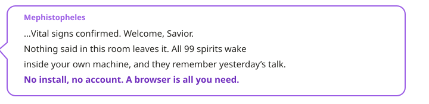</td>
</tr>
</table>

**EverSoul AI Chat** is a subculture romance chat with spirits that runs entirely inside your own machine. All 99 spirits keep their own names, personalities and speech habits, greet you as Savior, and carry on today's conversation remembering what you said yesterday.

Conversations are never sent to an outside server: an on-device LLM writes every reply on this machine. Open the address in a browser and the Chrome built-in Prompt API model gives the spirits their voice, with the record kept in this browser's IndexedDB. Download `evai-server`, run it, open `http://127.0.0.1:9999/`, and the same screen lets you pick a model from the Ollama on your PC while chats, memories and settings are stored in the SQLite database in the server folder. Either way the whole record exports to a single JSON file and restores from it.

A spirit here is not a puppet reciting lines. Every turn's scene and inner thought is kept as that spirit's memory, and bond, jealousy and the relationships with the other spirits are recomputed from the database to decide that day's tone and attitude. Stay silent too long and a spirit may speak first.

The official artwork of all 99 spirits, 522 conversation backgrounds, and EverTalk's own screen layout are bundled as they are. Each spirit's name, temper and speech live one file at a time under `data/personas/`, with Korean, English and Chinese (Traditional/Simplified) values prepared in advance, so changing language never dulls what makes that spirit herself.

<p align="center">
  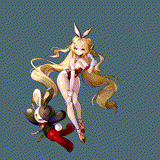
  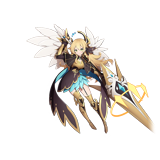
  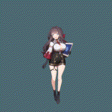
  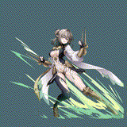
  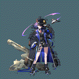
  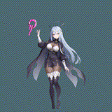
</p>


---

## Try it now

<table>
<tr>
<td width="150" align="center"></td>
<td>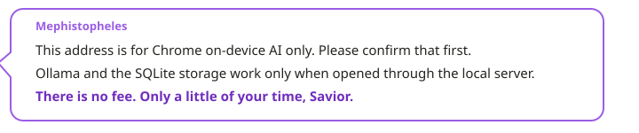</td>
</tr>
</table>

- **Through the local server**: run `evai-server` from a package built by [Releases](https://github.com/GarnetRapture/evai/releases) or [GitHub Actions](https://github.com/GarnetRapture/evai/actions) and open `http://127.0.0.1:9999/`. The first run downloads the spirit assets on its own, you can pick a local Ollama model, and the record is stored in the SQLite database in the server folder.
- **Browser on-device AI**: open `dist/` in Chrome, finish "How to turn Chrome on-device AI on" below, and you can chat with no installation; the record stays in that browser's IndexedDB.
- **Other browsers**: Firefox, Edge, Whale, Brave and Opera cannot use on-device AI. Use the local server together with Ollama.

---

## Which browser can I use?

<table>
<tr>
<td width="150" align="center"></td>
<td>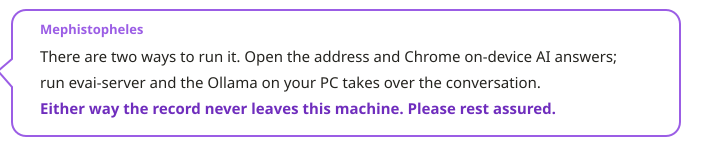</td>
</tr>
</table>

Any PC desktop browser can get in. The only difference is which engine gives the spirits their voice. Mobile web is not supported.

| Browser | Chat engine | What you prepare |
| --- | --- | --- |
|  | Chrome's built-in AI (Gemini Nano, or Gemma 4 with the flag on) · Ollama too when opened through the local server | Press "Download and prepare" once in Settings |
|  | Local Ollama (EVAI local server required) | Install Ollama and one model, run `evai-server` |
|  | Local Ollama (EVAI local server required) · built-in AI also appears if the browser exposes the `LanguageModel` API | Install Ollama and one model, run `evai-server` |
|  | Local Ollama (EVAI local server required) | Install Ollama and one model, run `evai-server` |
|   | Local Ollama (EVAI local server required) | Install Ollama and one model, run `evai-server` |

On first entry the app calls `/api/runtime` to see whether it was opened through the EVAI local server. On the local server the Ollama guide and model list appear and data is stored in SQLite. As a plain web page only Chrome's built-in AI is used, and the setup screen recommends running locally with a link to this repository.

---

## Key Features

- **99 spirits, each herself and not an imitation**: name, grade, race, class, birthday, likes, signature lines and EverTalk dialogue are read into a system prompt written for that spirit alone.
- **Two chat engines**: Chrome's built-in model and the Ollama on your PC. The EVAI local server relays to Ollama, every model in `ollama ls` appears in the list, and only the model you pick is used.
- **The spirit remembers your conversations**: every turn's scene and inner thought is saved as that spirit's memory, and related memories are passed along in later conversations. Once 8 memories remain unsummarized, the summary is rebuilt into the system prompt.
- **One spirit at a time**: switching spirits stops the previous reply immediately and keeps a model session only for the spirit you are talking to.
- **Change the language, keep the spirit**: UI text, notices, errors and the source spirit data switch together across Korean, English and Simplified Chinese.
- **Preferred Soul**: star a spirit and she moves to the top of the Familiarity tab and is selected first the next time you open the app.
- **Risu modules**: import `.risum` modules, switch them on or off, and the description and lorebook of active modules are added to the system prompt.
- **The record stays on your PC**: through the local server it lives in the SQLite database in the server folder; as a plain web page, in the browser's IndexedDB. Either way JSON export, import and point-in-time restore are supported.
- **Talk backgrounds**: 522 official illustration backgrounds to change the mood of the chat window.

<p align="center">
  
  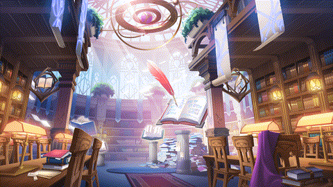
  
  
  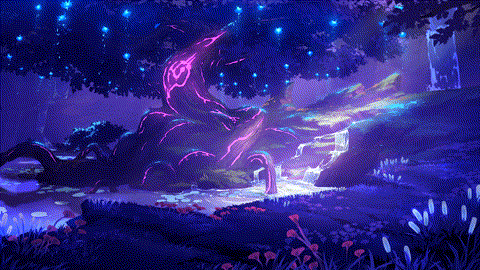
  
</p>

## Chat Models

### Chrome built-in AI

<table>
<tr>
<td width="150" align="center"></td>
<td>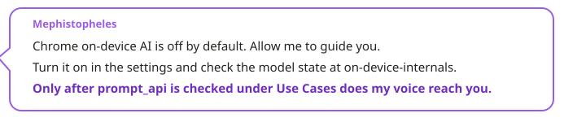</td>
</tr>
</table>

- **Preparation**: Press "Download and prepare" in Settings > On-device Models and Chrome downloads the model. The download only starts from a user click.
- **Model choice**: Chrome picks the Gemini Nano size and GPU/CPU backend for the device. Turning on `chrome://flags/#gemma4-for-built-in-ai` and restarting switches to Gemma 4, and the app confirms the real flag state from the Local State file.
- **Chrome requirements** ([official Chrome docs](https://developer.chrome.com/docs/ai/prompt-api)): Windows 10/11, macOS 13+, Linux, or ChromeOS (Chromebook Plus); at least 22 GB free on the drive holding the Chrome profile; a GPU with more than 4 GB of VRAM, or 16 GB of RAM and 4+ CPU cores; an unmetered network. It does not work in Chrome for Android or iOS.
- **Diagnostics**: Model state is shown at `chrome://on-device-internals`. Regular web pages cannot change `chrome://flags`.

#### How to turn Chrome on-device AI on

<p align="center">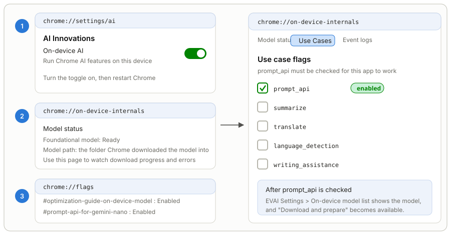</p>

1. **Turn on on-device AI** — Open `chrome://settings/ai` and switch on **AI Innovations > On-device AI**. While this toggle is off Chrome never downloads the model, and `LanguageModel` keeps answering `unavailable` even when it exists on the page. Quit Chrome completely and start it again after switching it on.
2. **Watch the model state** — Open `chrome://on-device-internals`. The **Model status** screen shows whether the foundational model is ready, the download progress, and the failure reason, and the **Model path** entry is the folder Chrome stored the model files in. That same folder is what you link under "Chrome-installed models" in the app settings.
3. **Check `prompt_api` under Use Cases** — The **Use Cases** tab of the same page lists the per-feature flags. **`prompt_api` must be checked** for the Prompt API this app uses to work. Without that check the chat never starts, even when the model is ready.
4. **When flags are needed** — Depending on the channel and version, set `chrome://flags/#optimization-guide-on-device-model` to **Enabled** and `chrome://flags/#prompt-api-for-gemini-nano` to **Enabled**, then restart, before steps 2 and 3 show anything. Turn on `chrome://flags/#gemma4-for-built-in-ai` as well to switch to Gemma 4.
5. **Prepare it in the app** — Once the steps above are done, the model appears in EVAI Settings > On-device Models. Press "Download and prepare" once so Chrome fetches the model, and follow the progress again at `chrome://on-device-internals`.

Chrome deletes the model when free space drops below 22 GB. Free some space and press "Download and prepare" again.

### Local Ollama

<table>
<tr>
<td width="150" align="center"></td>
<td>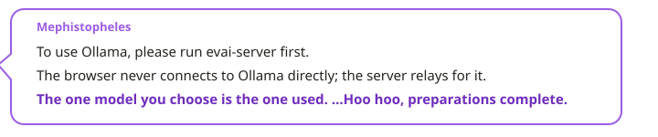</td>
</tr>
</table>

Ollama is used together with the EVAI local server. The browser never connects to Ollama directly: requests go to `/api/ollama` on the same address (`http://127.0.0.1:9999`) and the server relays them. Use whatever model fits your PC; from a small 3B model up to 30B or 120B, if Ollama can run it, the app can use it.

1. Install and start Ollama from [ollama.com](https://ollama.com/download).
2. Download the model you want.

   ```bash
   ollama --version
   ollama pull <model:tag>
   ollama pull hf.co/<user>/<repository>:<quantization>
   ```

   You can also build a model from a GGUF file you already have. This is Windows PowerShell:

   ```powershell
   Set-Content "$env:TEMP\Modelfile.evai" 'FROM D:\model\my-model.gguf'
   ollama create my-model -f "$env:TEMP\Modelfile.evai"
   Remove-Item "$env:TEMP\Modelfile.evai" -Force
   ```

3. Run the model once and check the lists. The app only uses the model you pick in the settings model list.

   ```bash
   ollama run my-model
   ollama ls
   ollama ps
   ```

4. Run `evai-server` from the folder that holds the web build and open `http://127.0.0.1:9999/`. Press "Check connection" on the setup screen (or in Settings > Local Ollama Models) and pick the model you want; that model stays fixed.

**Check that Ollama accepts network access.** Turn on "Expose Ollama to the network" in the Ollama app settings, or set `OLLAMA_HOST` to `0.0.0.0:11434`, then start Ollama again. `OLLAMA_ORIGINS` is no longer needed because the browser never calls Ollama directly; the EVAI local server makes the request instead.

```powershell
[Environment]::SetEnvironmentVariable('OLLAMA_HOST', '0.0.0.0:11434', 'User')
```

On macOS use `launchctl setenv OLLAMA_HOST "0.0.0.0:11434"`; on Linux with systemd, add `Environment="OLLAMA_HOST=0.0.0.0:11434"` through `systemctl edit ollama.service` and restart Ollama. If the Ollama address differs from the default, enter it in "Ollama address" under Settings > Local Ollama Models and the server relays there.

---

## Local Server Launcher (evai-server)

It runs on Windows, Linux, and macOS. The web build (`index.html`, `assets/`) and the database folder (`evai-database/`) must sit next to the executable. The release package ships an empty `evai.sqlite3` that already carries the schema.

| OS | Executable | How to run |
| --- | --- | --- |
|  x86_64 | `evai-server.exe` | Double-click it and a console window opens. Closing the window stops the server. |
|  x86_64 | `evai-server` | `./evai-server` in a terminal |
|  Apple Silicon | `evai-server` | `./evai-server` in a terminal. A downloaded file may need `xattr -d com.apple.quarantine evai-server` the first time. |

```text
EVAI local server
root: C:\EVAI
database: C:\EVAI\evai-database\evai.sqlite3
open: http://127.0.0.1:9999/
close this window to stop the server.
```

- Files are always served from the folder that holds the executable, no matter where you launch it from. If that folder has no `index.html`, it exits right away.
- It listens only on `127.0.0.1`, so other PCs cannot reach it. Requests whose Host header is not `127.0.0.1:port` or `localhost:port` are refused.
- The default port is `9999`; change it with `evai-server --port 48000`.
- It sends the same `Cross-Origin-Opener-Policy: same-origin` and `Cross-Origin-Embedder-Policy: require-corp` headers as the dev server.
- Paths that escape the folder are blocked, and static files accept only `GET` and `HEAD`. The `evai-database` folder is never served.
- `/api/runtime` returns the server info (version, SQLite version, database path), `/api/storage/*` reads, writes, restores, and resets SQLite, and `/api/ollama/*` proxies Ollama. `/api/*` requests are accepted only when the Origin is `http://127.0.0.1:port` or `http://localhost:port`.

GitHub Actions has a separate server workflow for each OS (Build Server Windows, Build Server Linux, Build Server macOS). Run the one for your OS and it packs the web build and the executable together, so you just extract and run.

## Build it yourself with GitHub Actions

The workflow files come along when you fork. Press a button on your fork's **Actions** tab and GitHub builds everything and uploads a package. You don't need Node.js or a compiler on your PC.

<p align="center">
  <a href="https://github.com/GarnetRapture/evai/fork"></a>
  <a href="https://github.com/GarnetRapture/evai/actions/workflows/build-web.yml"></a>
  <a href="https://github.com/GarnetRapture/evai/actions/workflows/build-server-windows.yml"></a>
  <a href="https://github.com/GarnetRapture/evai/actions/workflows/build-server-linux.yml"></a>
  <a href="https://github.com/GarnetRapture/evai/actions/workflows/build-server-macos.yml"></a>
</p>

| Workflow | Output | Use it when |
| --- | --- | --- |
| [Build Web](.github/workflows/build-web.yml) | `evai-web-v<version>-<7-char commit>.zip` (`dist/`) | Uploading to a static host (Chrome on-device AI only) |
| [Build Server Windows](.github/workflows/build-server-windows.yml) | `evai-server-windows-x86_64-v<version>-<7-char commit>.zip` (`dist/` + `evai-server.exe` + `evai-database/`) | Opening the app with the launcher on Windows |
| [Build Server Linux](.github/workflows/build-server-linux.yml) | `evai-server-linux-x86_64-v<version>-<7-char commit>.tar.gz` (`dist/` + `evai-server` + `evai-database/`) | Opening the app with the launcher on Linux |
| [Build Server macOS](.github/workflows/build-server-macos.yml) | `evai-server-macos-arm64-v<version>-<7-char commit>.tar.gz` (`dist/` + `evai-server` + `evai-database/`) | Opening the app with the launcher on an Apple Silicon Mac |

### Step 1 — Turn Actions on in your fork

A forked repository starts with its workflows disabled. Open the **Actions** tab of your fork and press the green **`I understand my workflows, go ahead and enable them`** button once. That is all, once per fork.

<p align="center">
  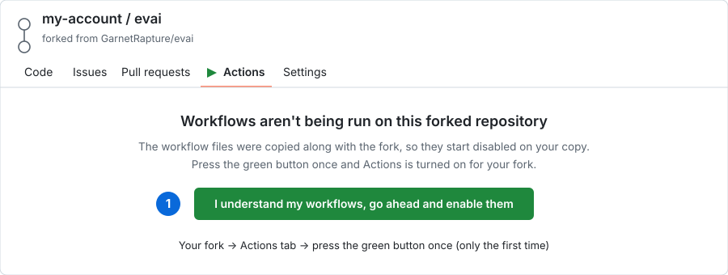
</p>

### Step 2 — Press `Run workflow`

Pick **Build Web** or the **Build Server Windows / Linux / macOS** workflow for your OS in the left-hand list, open **`Run workflow`** on the right, and press the green **`Run workflow`** button. There is nothing to fill in, and the branch can stay at its default.

<p align="center">
  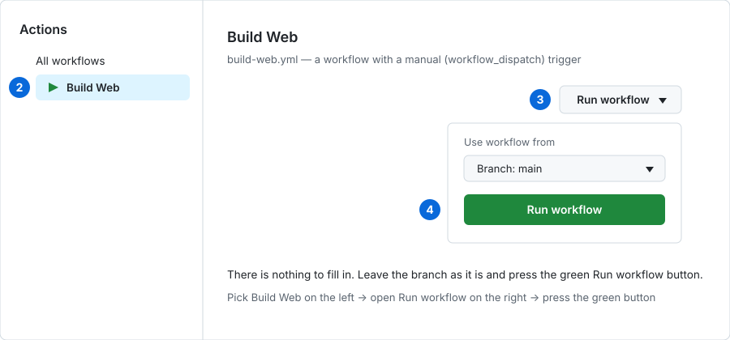
</p>

### Step 3 — Download the finished package

When the run finishes it gets a green check. Open that run and download what you need from **Artifacts** at the bottom. A server package unpacks into a ready-to-run layout (`index.html` · `assets/` · `evai-server` · `evai-database/`) — just run the executable.

<p align="center">
  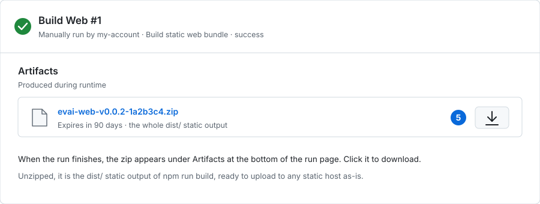
</p>

### What the workflows actually do

| Workflow | Runner | Steps |
| --- | --- | --- |
| Build Web | `ubuntu-latest` with Node.js 24 | `npm install` → `npm run build` (`tsc -b` + `vite build`) → upload `dist/` as a zip |
| Build Server Windows | `windows-latest` | web build, install xmake, `sh server/build.sh` (MSVC, C++26), merge the executable and `evai-database/` into `dist/`, upload a zip |
| Build Server Linux | `ubuntu-24.04` | web build, install xmake, `sh server/build.sh`, upload a tar.gz (keeps the execute bit) |
| Build Server macOS | `macos-15` (Apple Silicon) | web build, install xmake, `sh server/build.sh`, upload a tar.gz (keeps the execute bit) |

Packaging removes the WAL/shm temporary files, `evai-server.ini`, the error log and source maps, and the incremental build output (`build/`, `.xmake/`, `server/build/`) is deleted afterwards.

### Good to know

- The manual **`Run workflow` button appears only while the workflow file is on the default branch** ([official GitHub docs](https://docs.github.com/en/actions/how-tos/manage-workflow-runs/manually-run-a-workflow)). Right after a fork it already is, so there is nothing to do.
- The build runs in your own repository on your own account. On a public repository with GitHub-hosted standard runners, [Actions usage is free](https://docs.github.com/en/billing/concepts/product-billing/github-actions). A private fork draws on the account's included minutes.
- Official Releases carry no build files. Get the executable and web files from the workflows above.
- The Android build workflow is **pending**. It will be listed above once it is ready.

---

## Android App

<p align="center">
  
</p>

`android/` holds an Android app that uses AICore Gemini Nano and LiteRT-LM. The PC web app and the local server come first, so Android is **pending**; its build workflow and distribution will be added once that work is finished.

## Downloading the spirit assets

Spirit artwork, story scripts, cutscene videos and voice lines are too large (about 3.9 GB) to keep in this repository, so they live in a public dataset.

**With the local server you do not need to fetch them yourself.** The first run of `evai-server.exe` asks for the console language and the voice language (Korean / Japanese / both / skip), then downloads only the missing files in parallel and opens the service once that finishes. An interrupted download resumes on the next run, and a file that sits in the wrong place is moved instead of downloaded again.

To fetch them manually:

```bash
hf download garnetrapture/evai-assets --repo-type dataset --local-dir .
```

If `hf` is missing, install it with `pip install -U huggingface_hub`. The dataset is public, so no login is required and plain `curl` works too.

| Destination | Contents |
| --- | --- |
| `data/dataset/` | Spirit profiles and dialogue JSON |
| `data/story/` | Main and bond story scripts |
| `data/story-media/` | Story cutscene videos, Korean and Japanese voice lines |
| `data/eversoul-assets/` | Spirit artwork, backgrounds, UI images |

## Technical documents

The code structure and the build steps live in their own documents.

- [Architecture and tech stack](docs/architecture.en.md) — domain layout, storage layer, prompt assembly, local server API
- [Build and release](docs/build.en.md) — development run, web and server builds, GitHub Actions
- [Spirit data schema](docs/persona-data.en.md) — `data/personas/*.json` fields and versioning rules

---


## Full Spirit Gallery (99 Spirits)

A complete gallery built by looking through all 99 `data/personas/*.json` files, listing each spirit's artwork alongside its real Korean (ko), English (en), and Simplified Chinese (zh_cn) names exactly as stored in the data. The artwork folder names are taken exactly the way `resolveSpiritAssetFolder` in `src/domains/persona/logic.ts` looks them up (27 spirits whose in-game display name differs from their actual artwork folder name follow the `explicitAssetFolders` mapping as-is, and Canney, Casper, and Irene, whose artwork file prefix differs from the folder name, follow the `assetFilePrefixes` mapping).

<table>
<tr>
<td align="center">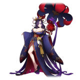<br/><sub>아야메<br/>Ayame<br/>綾織</sub></td>
<td align="center">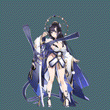<br/><sub>아야메(츠쿠요미)<br/>Ayame (Tsukuyomi)<br/>綾織（月讀）</sub></td>
<td align="center">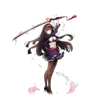<br/><sub>아키<br/>Aki<br/>秋</sub></td>
<td align="center">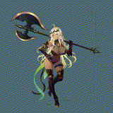<br/><sub>알리샤<br/>Alisha<br/>艾麗西雅</sub></td>
<td align="center"><br/><sub>아드리안<br/>Adrianne<br/>阿德里安</sub></td>
<td align="center">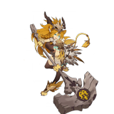<br/><sub>아이라<br/>Aira<br/>艾拉</sub></td>
<td align="center">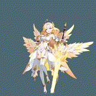<br/><sub>클라우디아(대천사)<br/>Claudia (Archangel)<br/>克勞迪婭（大天使）</sub></td>
<td align="center">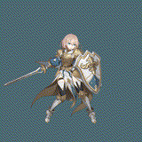<br/><sub>클레르<br/>Claire<br/>克萊兒</sub></td>
</tr>
<tr>
<td align="center">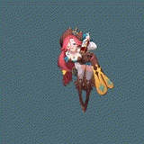<br/><sub>셰리<br/>Cherrie<br/>雪莉</sub></td>
<td align="center">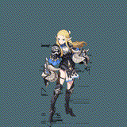<br/><sub>클로이<br/>Chloe<br/>克羅伊</sub></td>
<td align="center">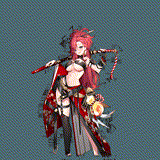<br/><sub>셰리(낭만)<br/>Cherrie (Romantic)<br/>雪莉（浪漫）</sub></td>
<td align="center">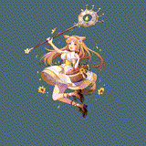<br/><sub>클라라<br/>Clara<br/>克拉拉</sub></td>
<td align="center">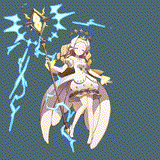<br/><sub>클라우디아<br/>Claudia<br/>克勞迪婭</sub></td>
<td align="center">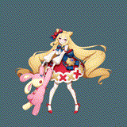<br/><sub>가넷<br/>Garnet<br/>佳妮特</sub></td>
<td align="center">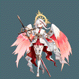<br/><sub>캐서린(광휘)<br/>Catherine (Radiance)<br/>凱瑟琳（光輝）</sub></td>
<td align="center">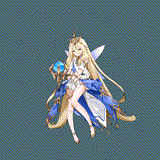<br/><sub>도미니크<br/>Dominique<br/>多米尼克</sub></td>
</tr>
<tr>
<td align="center">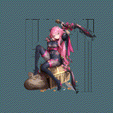<br/><sub>에일린<br/>Eileen<br/>艾琳</sub></td>
<td align="center">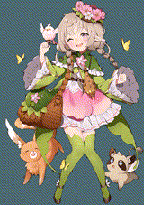<br/><sub>이나<br/>Ina<br/>伊娜</sub></td>
<td align="center">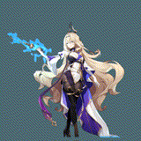<br/><sub>헤이즐<br/>Hazel<br/>黑伊茲爾</sub></td>
<td align="center">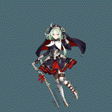<br/><sub>캐서린<br/>Catherine<br/>凱瑟琳</sub></td>
<td align="center">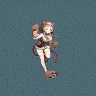<br/><sub>도라<br/>Dora<br/>朵菈</sub></td>
<td align="center"><br/><sub>가넷(열락)<br/>Garnet (Rapture)<br/>佳妮特（狂喜）</sub></td>
<td align="center">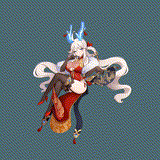<br/><sub>홍란<br/>Honglan<br/>紅蘭</sub></td>
<td align="center">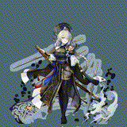<br/><sub>한울<br/>Hanul<br/>韓羽</sub></td>
</tr>
<tr>
<td align="center">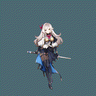<br/><sub>이디스<br/>Edith<br/>伊迪絲</sub></td>
<td align="center">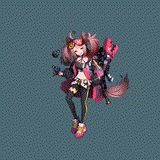<br/><sub>플린<br/>Flynn<br/>弗林</sub></td>
<td align="center">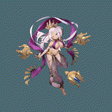<br/><sub>에루샤<br/>Erusha<br/>艾魯莎</sub></td>
<td align="center">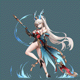<br/><sub>홍란(무쌍)<br/>Honglan (Peerless)<br/>紅蘭（無雙）</sub></td>
<td align="center">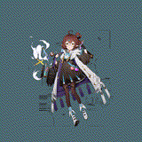<br/><sub>에리카<br/>Erika<br/>艾麗卡</sub></td>
<td align="center">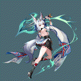<br/><sub>하루(카무이)<br/>Haru (Kamuy)<br/>河路（神威）</sub></td>
<td align="center">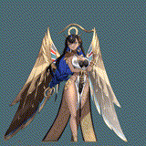<br/><sub>카넬리안<br/>Carnelian<br/>卡內莉安</sub></td>
<td align="center">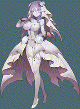<br/><sub>카렌<br/>Karen<br/>卡倫</sub></td>
</tr>
<tr>
<td align="center">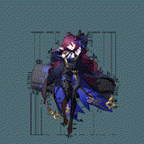<br/><sub>조앤<br/>Joanne<br/>瓊</sub></td>
<td align="center">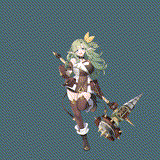<br/><sub>다프네<br/>Daphne<br/>達芙妮</sub></td>
<td align="center">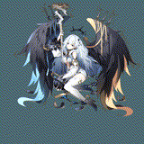<br/><sub>이브<br/>Eve<br/>夏娃</sub></td>
<td align="center"><br/><sub>제이드<br/>Jade<br/>潔依德</sub></td>
<td align="center"><br/><sub>토키사키 쿠루미<br/>Kurumi Tokisaki<br/>時崎狂三</sub></td>
<td align="center"><br/><sub>재클린<br/>Jacqueline<br/>潔克琳</sub></td>
<td align="center"><br/><sub>라리마<br/>Larimar<br/>拉利瑪</sub></td>
<td align="center"><br/><sub>하루<br/>Haru<br/>河路</sub></td>
</tr>
<tr>
<td align="center"><br/><sub>지호<br/>Jiho<br/>智河</sub></td>
<td align="center"><br/><sub>르웨인<br/>Lewayne<br/>樂溫</sub></td>
<td align="center"><br/><sub>브라이스<br/>Bryce<br/>布萊斯</sub></td>
<td align="center"><br/><sub>칸나<br/>Kanna<br/>坎納</sub></td>
<td align="center"><br/><sub>지호(미르)<br/>Jiho (Mir)<br/>智河（米爾）</sub></td>
<td align="center"><br/><sub>벨레드<br/>Beleth<br/>貝萊德</sub></td>
<td align="center"><br/><sub>린지<br/>Linzy<br/>琳賽</sub></td>
<td align="center"><br/><sub>라우라<br/>Laura<br/>蘿拉</sub></td>
</tr>
<tr>
<td align="center"><br/><sub>린지(타나토스)<br/>Linzy (Thanatos)<br/>琳賽（桑納托斯）</sub></td>
<td align="center"><br/><sub>릴리트<br/>Lilith<br/>莉莉絲</sub></td>
<td align="center"><br/><sub>리젤로테<br/>Lizelotte<br/>莉澤洛特</sub></td>
<td align="center"><br/><sub>루테<br/>Lute<br/>魯特</sub></td>
<td align="center"><br/><sub>마농<br/>Manon<br/>瑪儂</sub></td>
<td align="center"><br/><sub>멜피스<br/>Melfice<br/>梅爾菲斯</sub></td>
<td align="center"><br/><sub>메피스토펠레스<br/>Mephistopheles<br/>梅菲斯托佩萊斯</sub></td>
<td align="center"><br/><sub>메릴<br/>Meryl<br/>梅莉兒</sub></td>
</tr>
<tr>
<td align="center"><br/><sub>미카<br/>Mica<br/>米卡</sub></td>
<td align="center"><br/><sub>메피스토펠레스(여명)<br/>Mephistopheles (Dawn)<br/>梅菲斯托佩萊斯（黎明）</sub></td>
<td align="center"><br/><sub>미리암<br/>Miriam<br/>米里昂</sub></td>
<td align="center"><br/><sub>무명<br/>Nameless<br/>無名</sub></td>
<td align="center"><br/><sub>나이아<br/>Naiah<br/>娜伊雅</sub></td>
<td align="center"><br/><sub>나오미<br/>Naomi<br/>直美</sub></td>
<td align="center"><br/><sub>미리암(잔영)<br/>Miriam (Afterimage)<br/>米里昂（殘影）</sub></td>
<td align="center"><br/><sub>니콜<br/>Nicole<br/>妮可</sub></td>
</tr>
<tr>
<td align="center"><br/><sub>니아<br/>Nia<br/>妮亞</sub></td>
<td align="center"><br/><sub>오닉스<br/>Onyx<br/>歐妮絲</sub></td>
<td align="center"><br/><sub>니니<br/>Nini<br/>妮妮</sub></td>
<td align="center"><br/><sub>오토하<br/>Otoha<br/>乙葉</sub></td>
<td align="center"><br/><sub>페트라(각혼)<br/>Petra (Awakened Soul)<br/>佩特拉（覺魂）</sub></td>
<td align="center"><br/><sub>레베카<br/>Rebecca<br/>瑞貝卡</sub></td>
<td align="center"><br/><sub>로제<br/>Rose<br/>蘿絲</sub></td>
<td align="center"><br/><sub>르네<br/>Renee<br/>勒內</sub></td>
</tr>
<tr>
<td align="center"><br/><sub>리타<br/>Rita<br/>麗塔</sub></td>
<td align="center"><br/><sub>로제(홍염)<br/>Rose (Prominence)<br/>蘿絲（紅焰）</sub></td>
<td align="center"><br/><sub>르네(백은)<br/>Renee (Argent)<br/>勒內（白銀）</sub></td>
<td align="center"><br/><sub>타샤<br/>Tasha<br/>塔莎</sub></td>
<td align="center"><br/><sub>페트라<br/>Petra<br/>佩特拉</sub></td>
<td align="center"><br/><sub>프림<br/>Prim<br/>弗里姆</sub></td>
<td align="center"><br/><sub>사쿠요(업화)<br/>Sakuyo (Inferno)<br/>櫻世（業火）</sub></td>
<td align="center"><br/><sub>순이<br/>Soonie<br/>順伊</sub></td>
</tr>
<tr>
<td align="center"><br/><sub>샤링<br/>Sharinne<br/>夏琳</sub></td>
<td align="center"><br/><sub>비올레트<br/>Violette<br/>薇奧蕾特</sub></td>
<td align="center"><br/><sub>야토가미 토카<br/>Tohka Yatogami<br/>夜刀神十香</sub></td>
<td align="center"><br/><sub>탈리아<br/>Talia<br/>塔利亞</sub></td>
<td align="center"><br/><sub>시그리드<br/>Sigrid<br/>希格莉德</sub></td>
<td align="center"><br/><sub>시하<br/>Seeha<br/>西荷</sub></td>
<td align="center"><br/><sub>루리<br/>Ruri<br/>魯莉</sub></td>
<td align="center"><br/><sub>바이스<br/>Weiss<br/>拜斯</sub></td>
</tr>
<tr>
<td align="center"><br/><sub>벨라나<br/>Velanna<br/>貝拉納</sub></td>
<td align="center"><br/><sub>비비안<br/>Vivienne<br/>薇薇安</sub></td>
<td align="center"><br/><sub>소연<br/>Xiaolian<br/>小蓮</sub></td>
<td align="center"><br/><sub>유리아<br/>Yuria<br/>尤里婭</sub></td>
<td align="center"><br/><sub>사쿠요<br/>Sakuyo<br/>櫻世</sub></td>
<td align="center"><br/><sub>유리아(아폴리온)<br/>Yuria (Apollyon)<br/>尤里婭（阿巴頓）</sub></td>
<td align="center"><br/><sub>웨리<br/>Wheri<br/>威里</sub></td>
<td align="center"><br/><sub>Canney<br/>Canney<br/>Canney</sub></td>
</tr>
<tr>
<td align="center"><br/><sub>Casper<br/>Casper<br/>Casper</sub></td>
<td align="center"><br/><sub>Irene<br/>Irene<br/>Irene</sub></td>
<td align="center"><br/><sub>Pixie<br/>Pixie<br/>Pixie</sub></td>
<td></td>
<td></td>
<td></td>
<td></td>
<td></td>
</tr>
</table>

Each spirit's artwork doesn't stop at a single picture. It's split across folders — `base` (everyday look), `costume`, `raid`, `gacha`, `srg` — so the same spirit has several different pictures on hand. The app shows the `base`, `costume`, and `raid` artwork as skins, and the skin you pick for each spirit is saved in settings.

<p align="center">
  
  
  
  
</p>
<p align="center"><sub>What's in Adrianne's folder — from left, base, costume, gacha, raid</sub></p>

<p align="center">
  <sub>© Kakao Games · Nine Ark. The illustrations, persona profiles, talk backgrounds and voice lines above belong to the original rights holders of <b>EverSoul</b>.<br/>
  This repository claims no rights to them and uses them only as a non-commercial fan project. See <a href="#license">License</a> below for the full scope.</sub>
</p>

---

## License

The **Apache License 2.0** in this repository covers only the source code this project wrote itself (`src/`, `server/`). This project holds no rights to the third-party works below.

- **Gemini Nano, Gemma 4** — models Google provides through Chrome. This repository neither bundles nor redistributes the weights; Chrome on the user's PC downloads and manages them.
- **Ollama and the models used with it** — installed by the user, and each model follows its own license. This repository ships no models.
- **EverSoul game resources** — spirit illustrations, talk backgrounds, source persona data, and voice lines remain the property of their original rights holders. This project claims no rights to them and uses them as a non-commercial fan project.

<p align="center">
  <a href="https://github.com/GarnetRapture/evai/watchers"></a>
  <a href="https://github.com/GarnetRapture/evai/stargazers"></a>
  <a href="https://github.com/GarnetRapture/evai/fork"></a>
</p>
