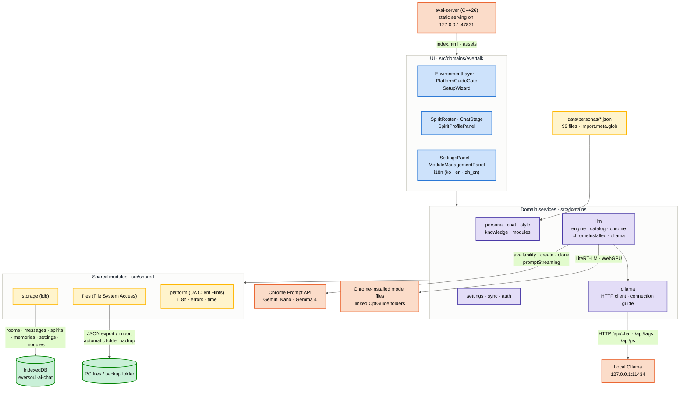

<p align="right">
  <a href="README.md"> 한국어</a> &nbsp;|&nbsp;
   <strong>English</strong>
</p>

<p align="center">
  
</p>

<h1 align="center">EverSoul AI Chat</h1>
<p align="center"><i>EverSoul spirit chat running on Chrome's built-in AI or the Ollama on your own PC</i></p>

<p align="center">
  
  
  
  
  
  
  
  
  
  
  
</p>

<p align="center">
  <a href="https://ai.everlib.pro/"></a>
  <a href="https://github.com/GarnetRapture/evai/fork"></a>
  <a href="https://github.com/GarnetRapture/evai/stargazers"></a>
  <a href="https://github.com/GarnetRapture/evai/watchers"></a>
</p>

<p align="center">
  <a href="https://github.com/GarnetRapture/evai/actions/workflows/build-web.yml"></a>
  <a href="https://github.com/GarnetRapture/evai/actions/workflows/build-local-server.yml"></a>
  <a href="https://github.com/GarnetRapture/evai/releases"></a>
</p>

<p align="center">
  <sub>Chrome uses its built-in AI. Every other browser uses the Ollama installed on your PC as the chat engine.</sub>
</p>

---

## Overview

**EverSoul AI Chat** is an AI chat project made to keep EverSoul close. It started from a simple wish to hold on to the spirits' memories. All 99 spirits are loaded straight from the real game data, and each one talks in their own personality and voice.

It is a local-first web app that never sends your conversations to a server. In Chrome it uses the Prompt API model built into the browser; in other browsers such as Firefox it talks directly to the Ollama running on your PC. Conversations, memories, and settings live only in the browser's IndexedDB, and you can export them to a file or back them up to a PC folder automatically.

If running a web server is a hassle, use the `evai-server` launcher. Put it next to the built web files and run it, and it opens the app on an address only this PC can reach.

The full official artwork of all 99 spirits, 522 conversation backgrounds, and the UI that EverTalk itself used are all bundled directly into this project. Each spirit's name, personality, and speech patterns are organized one file at a time under `data/personas/`, with per-language values prepared in Korean, English, and Chinese (Traditional/Simplified) — so switching languages never breaks what makes that spirit feel like itself.

<p align="center">
  
  
  
  
  
  
</p>

---

## Full Spirit Gallery (99 Spirits)

A complete gallery built by looking through all 99 `data/personas/*.json` files, listing each spirit's artwork alongside its real Korean (ko), English (en), and Simplified Chinese (zh_cn) names exactly as stored in the data. The artwork folder names are taken exactly the way `resolveSpiritAssetFolder` in `src/domains/persona/logic.ts` looks them up (27 spirits whose in-game display name differs from their actual artwork folder name follow the `explicitAssetFolders` mapping as-is, and Canney, Casper, and Irene, whose artwork file prefix differs from the folder name, follow the `assetFilePrefixes` mapping).

<table>
<tr>
<td align="center"><br/><sub>아야메<br/>Ayame<br/>綾織</sub></td>
<td align="center"><br/><sub>아야메(츠쿠요미)<br/>Ayame (Tsukuyomi)<br/>綾織（月讀）</sub></td>
<td align="center"><br/><sub>아키<br/>Aki<br/>秋</sub></td>
<td align="center"><br/><sub>알리샤<br/>Alisha<br/>艾麗西雅</sub></td>
<td align="center"><br/><sub>아드리안<br/>Adrianne<br/>阿德里安</sub></td>
<td align="center"><br/><sub>아이라<br/>Aira<br/>艾拉</sub></td>
<td align="center"><br/><sub>클라우디아(대천사)<br/>Claudia (Archangel)<br/>克勞迪婭（大天使）</sub></td>
<td align="center"><br/><sub>클레르<br/>Claire<br/>克萊兒</sub></td>
</tr>
<tr>
<td align="center"><br/><sub>셰리<br/>Cherrie<br/>雪莉</sub></td>
<td align="center"><br/><sub>클로이<br/>Chloe<br/>克羅伊</sub></td>
<td align="center"><br/><sub>셰리(낭만)<br/>Cherrie (Romantic)<br/>雪莉（浪漫）</sub></td>
<td align="center"><br/><sub>클라라<br/>Clara<br/>克拉拉</sub></td>
<td align="center"><br/><sub>클라우디아<br/>Claudia<br/>克勞迪婭</sub></td>
<td align="center"><br/><sub>가넷<br/>Garnet<br/>佳妮特</sub></td>
<td align="center"><br/><sub>캐서린(광휘)<br/>Catherine (Radiance)<br/>凱瑟琳（光輝）</sub></td>
<td align="center"><br/><sub>도미니크<br/>Dominique<br/>多米尼克</sub></td>
</tr>
<tr>
<td align="center"><br/><sub>에일린<br/>Eileen<br/>艾琳</sub></td>
<td align="center"><br/><sub>이나<br/>Ina<br/>伊娜</sub></td>
<td align="center"><br/><sub>헤이즐<br/>Hazel<br/>黑伊茲爾</sub></td>
<td align="center"><br/><sub>캐서린<br/>Catherine<br/>凱瑟琳</sub></td>
<td align="center"><br/><sub>도라<br/>Dora<br/>朵菈</sub></td>
<td align="center"><br/><sub>가넷(열락)<br/>Garnet (Rapture)<br/>佳妮特（狂喜）</sub></td>
<td align="center"><br/><sub>홍란<br/>Honglan<br/>紅蘭</sub></td>
<td align="center"><br/><sub>한울<br/>Hanul<br/>韓羽</sub></td>
</tr>
<tr>
<td align="center"><br/><sub>이디스<br/>Edith<br/>伊迪絲</sub></td>
<td align="center"><br/><sub>플린<br/>Flynn<br/>弗林</sub></td>
<td align="center"><br/><sub>에루샤<br/>Erusha<br/>艾魯莎</sub></td>
<td align="center"><br/><sub>홍란(무쌍)<br/>Honglan (Peerless)<br/>紅蘭（無雙）</sub></td>
<td align="center"><br/><sub>에리카<br/>Erika<br/>艾麗卡</sub></td>
<td align="center"><br/><sub>하루(카무이)<br/>Haru (Kamuy)<br/>河路（神威）</sub></td>
<td align="center"><br/><sub>카넬리안<br/>Carnelian<br/>卡內莉安</sub></td>
<td align="center"><br/><sub>카렌<br/>Karen<br/>卡倫</sub></td>
</tr>
<tr>
<td align="center"><br/><sub>조앤<br/>Joanne<br/>瓊</sub></td>
<td align="center"><br/><sub>다프네<br/>Daphne<br/>達芙妮</sub></td>
<td align="center"><br/><sub>이브<br/>Eve<br/>夏娃</sub></td>
<td align="center"><br/><sub>제이드<br/>Jade<br/>潔依德</sub></td>
<td align="center"><br/><sub>토키사키 쿠루미<br/>Kurumi Tokisaki<br/>時崎狂三</sub></td>
<td align="center"><br/><sub>재클린<br/>Jacqueline<br/>潔克琳</sub></td>
<td align="center"><br/><sub>라리마<br/>Larimar<br/>拉利瑪</sub></td>
<td align="center"><br/><sub>하루<br/>Haru<br/>河路</sub></td>
</tr>
<tr>
<td align="center"><br/><sub>지호<br/>Jiho<br/>智河</sub></td>
<td align="center"><br/><sub>르웨인<br/>Lewayne<br/>樂溫</sub></td>
<td align="center"><br/><sub>브라이스<br/>Bryce<br/>布萊斯</sub></td>
<td align="center"><br/><sub>칸나<br/>Kanna<br/>坎納</sub></td>
<td align="center"><br/><sub>지호(미르)<br/>Jiho (Mir)<br/>智河（米爾）</sub></td>
<td align="center"><br/><sub>벨레드<br/>Beleth<br/>貝萊德</sub></td>
<td align="center"><br/><sub>린지<br/>Linzy<br/>琳賽</sub></td>
<td align="center"><br/><sub>라우라<br/>Laura<br/>蘿拉</sub></td>
</tr>
<tr>
<td align="center"><br/><sub>린지(타나토스)<br/>Linzy (Thanatos)<br/>琳賽（桑納托斯）</sub></td>
<td align="center"><br/><sub>릴리트<br/>Lilith<br/>莉莉絲</sub></td>
<td align="center"><br/><sub>리젤로테<br/>Lizelotte<br/>莉澤洛特</sub></td>
<td align="center"><br/><sub>루테<br/>Lute<br/>魯特</sub></td>
<td align="center"><br/><sub>마농<br/>Manon<br/>瑪儂</sub></td>
<td align="center"><br/><sub>멜피스<br/>Melfice<br/>梅爾菲斯</sub></td>
<td align="center"><br/><sub>메피스토펠레스<br/>Mephistopheles<br/>梅菲斯托佩萊斯</sub></td>
<td align="center"><br/><sub>메릴<br/>Meryl<br/>梅莉兒</sub></td>
</tr>
<tr>
<td align="center"><br/><sub>미카<br/>Mica<br/>米卡</sub></td>
<td align="center"><br/><sub>메피스토펠레스(여명)<br/>Mephistopheles (Dawn)<br/>梅菲斯托佩萊斯（黎明）</sub></td>
<td align="center"><br/><sub>미리암<br/>Miriam<br/>米里昂</sub></td>
<td align="center"><br/><sub>무명<br/>Nameless<br/>無名</sub></td>
<td align="center"><br/><sub>나이아<br/>Naiah<br/>娜伊雅</sub></td>
<td align="center"><br/><sub>나오미<br/>Naomi<br/>直美</sub></td>
<td align="center"><br/><sub>미리암(잔영)<br/>Miriam (Afterimage)<br/>米里昂（殘影）</sub></td>
<td align="center"><br/><sub>니콜<br/>Nicole<br/>妮可</sub></td>
</tr>
<tr>
<td align="center"><br/><sub>니아<br/>Nia<br/>妮亞</sub></td>
<td align="center"><br/><sub>오닉스<br/>Onyx<br/>歐妮絲</sub></td>
<td align="center"><br/><sub>니니<br/>Nini<br/>妮妮</sub></td>
<td align="center"><br/><sub>오토하<br/>Otoha<br/>乙葉</sub></td>
<td align="center"><br/><sub>페트라(각혼)<br/>Petra (Awakened Soul)<br/>佩特拉（覺魂）</sub></td>
<td align="center"><br/><sub>레베카<br/>Rebecca<br/>瑞貝卡</sub></td>
<td align="center"><br/><sub>로제<br/>Rose<br/>蘿絲</sub></td>
<td align="center"><br/><sub>르네<br/>Renee<br/>勒內</sub></td>
</tr>
<tr>
<td align="center"><br/><sub>리타<br/>Rita<br/>麗塔</sub></td>
<td align="center"><br/><sub>로제(홍염)<br/>Rose (Prominence)<br/>蘿絲（紅焰）</sub></td>
<td align="center"><br/><sub>르네(백은)<br/>Renee (Argent)<br/>勒內（白銀）</sub></td>
<td align="center"><br/><sub>타샤<br/>Tasha<br/>塔莎</sub></td>
<td align="center"><br/><sub>페트라<br/>Petra<br/>佩特拉</sub></td>
<td align="center"><br/><sub>프림<br/>Prim<br/>弗里姆</sub></td>
<td align="center"><br/><sub>사쿠요(업화)<br/>Sakuyo (Inferno)<br/>櫻世（業火）</sub></td>
<td align="center"><br/><sub>순이<br/>Soonie<br/>順伊</sub></td>
</tr>
<tr>
<td align="center"><br/><sub>샤링<br/>Sharinne<br/>夏琳</sub></td>
<td align="center"><br/><sub>비올레트<br/>Violette<br/>薇奧蕾特</sub></td>
<td align="center"><br/><sub>야토가미 토카<br/>Tohka Yatogami<br/>夜刀神十香</sub></td>
<td align="center"><br/><sub>탈리아<br/>Talia<br/>塔利亞</sub></td>
<td align="center"><br/><sub>시그리드<br/>Sigrid<br/>希格莉德</sub></td>
<td align="center"><br/><sub>시하<br/>Seeha<br/>西荷</sub></td>
<td align="center"><br/><sub>루리<br/>Ruri<br/>魯莉</sub></td>
<td align="center"><br/><sub>바이스<br/>Weiss<br/>拜斯</sub></td>
</tr>
<tr>
<td align="center"><br/><sub>벨라나<br/>Velanna<br/>貝拉納</sub></td>
<td align="center"><br/><sub>비비안<br/>Vivienne<br/>薇薇安</sub></td>
<td align="center"><br/><sub>소연<br/>Xiaolian<br/>小蓮</sub></td>
<td align="center"><br/><sub>유리아<br/>Yuria<br/>尤里婭</sub></td>
<td align="center"><br/><sub>사쿠요<br/>Sakuyo<br/>櫻世</sub></td>
<td align="center"><br/><sub>유리아(아폴리온)<br/>Yuria (Apollyon)<br/>尤里婭（阿巴頓）</sub></td>
<td align="center"><br/><sub>웨리<br/>Wheri<br/>威里</sub></td>
<td align="center"><br/><sub>Canney<br/>Canney<br/>Canney</sub></td>
</tr>
<tr>
<td align="center"><br/><sub>Casper<br/>Casper<br/>Casper</sub></td>
<td align="center"><br/><sub>Irene<br/>Irene<br/>Irene</sub></td>
<td align="center"><br/><sub>Pixie<br/>Pixie<br/>Pixie</sub></td>
<td></td>
<td></td>
<td></td>
<td></td>
<td></td>
</tr>
</table>

Each spirit's artwork doesn't stop at a single picture. It's split across folders — `base` (everyday look), `costume`, `raid`, `gacha`, `srg` — so the same spirit has several different pictures on hand. The app shows the `base`, `costume`, and `raid` artwork as skins, and the skin you pick for each spirit is saved in settings.

<p align="center">
  
  
  
  
</p>
<p align="center"><sub>What's in Adrianne's folder — from left, base, costume, gacha, raid</sub></p>

---

## Which browser can I use?

Any PC desktop browser gets in. The only difference is where the chat engine comes from. Mobile web is not supported.

| Browser | Chat engine | What you prepare |
| --- | --- | --- |
|  | Chrome's built-in AI (Gemini Nano, or Gemma 4 with the flag on) or local Ollama | Press "Download and prepare" once in Settings |
|  | Local Ollama | Install Ollama and one model |
|  | Local Ollama (built-in AI also appears if the browser exposes the `LanguageModel` API) | Install Ollama and one model |
|  | Local Ollama | Install Ollama and one model |
|   | Local Ollama | Install Ollama and one model |

On first entry the app checks whether this browser has Chrome's built-in AI. If it doesn't, the setup screen shows the Ollama connection guide right away, and once Ollama connects it takes over the chat.

---

## Key Features

- **99 spirits, each with their own personality**: Name, grade, race, class, birthday, likes, representative lines, and EverTalk dialogue samples go into a separate system prompt for every spirit.
- **Two chat engines**: Chrome uses the browser's built-in model; other browsers use the Ollama on your PC. Any Ollama model works, and a model that is already running is picked first.
- **A spirit that remembers you**: Each turn is saved with the reply as that spirit's memory, and related memories are pulled back into later conversations. After 8 memories that have not been summarized yet, the model rebuilds the summary carried in the system prompt.
- **Focus on the spirit you are talking to**: Switching spirits stops the previous spirit's reply and keeps a model session only for the current one.
- **Switch languages, the spirit stays the same**: UI text, notices, errors, and source spirit data switch among Korean, English, and Simplified Chinese.
- **Preferred Soul**: Star a spirit to pin it to the top of the Familiarity tab and have it selected first when you reopen the app.
- **Risu modules**: Import `.risum` modules and turn them on or off; the description and lorebook of active modules are added to the system prompt.
- **Saved and backed up on your PC**: All data lives in the browser's IndexedDB, with file export and import, automatic folder backup, and point-in-time restore.
- **Backgrounds**: 522 official EverSoul illustration backgrounds to change the mood of the chat.

<p align="center">
  
  
  
  
  
  
</p>

---

## Architecture

It is a single React web app. Data stays in IndexedDB, and the chat engine is Chrome's built-in AI, the model files Chrome already downloaded, or local Ollama. `evai-server` only serves the built web files on `127.0.0.1`; it never touches data or models.



- **Environment detection**: PC desktop browsers are admitted. If `LanguageModel` exists the app uses Chrome's built-in AI; otherwise the setup screen shows the Ollama connection guide. `EnvironmentLayer` at the top shows the profile, browser and version, platform, and the WebGPU adapter confirmed through `requestAdapter()`.
- **Spirit data**: `src/domains/persona/archive.ts` loads `data/personas/*.json` through `import.meta.glob`, and the initial setup installs them into the IndexedDB `persona_profile` store. Per-language system prompts are cached in `persona_localized_prompt`.
- **System prompt**: The starting identity is assembled from the spirit's profile, personality and greeting, 12 lines sampled across the complete speech/story/EverTalk corpus, and 4 real `Savior → spirit` response exchanges. Each turn dynamically adds up to 2 topic-relevant real exchanges, 18 recent messages, 4 related memories out of 200 candidates, and 1 knowledge chunk. Digest, explicit memories, semantic relationship state, habits and bond counts alter the starting values only after real records exist. `zh_cn` is normalized to Simplified Chinese with OpenCC and emoji are removed from output.
- **Chrome session**: Only the active spirit's session is kept. The system prompt is the first `system` entry of `initialPrompts`, followed by the spirit's real `Savior → spirit` exchanges as `user/assistant` examples. Each request `clone()`s the session and picks recent history with `contextWindow`, `contextUsage`, and `measureContextUsage()` while leaving 384 tokens for the reply.
- **Ollama session**: The same system prompt and examples go to `/api/chat`. Some templates, such as Mistral's, insist on strictly alternating user/assistant turns, so consecutive messages from the same role are merged with their content intact. Requests carry `truncate: false` and `shift: false` so Ollama never silently cuts the conversation, and a 1-token measurement request checks the real prompt length first. If it does not fit, the oldest context goes first; the system prompt, the examples, and this turn's instruction always stay. The context size follows what Ollama actually loaded (`context_length` from `/api/ps`).
- **Reply checks**: Every engine returns the same JSON schema, and a reply that breaks the voice or language rules is generated once more.
- **Language declaration**: `availability()` and `create()` use identical options. English (the system-instruction language) and the selected app language are declared in `expectedInputs`, while only the app language is declared in `expectedOutputs`; unsupported combinations fall back to the model's base multilingual capability.
- **Memory**: The reply and its episodic `Savior/Spirit` memory are committed in one IndexedDB transaction. Related memories are found with a sparse lexical vector — 1–3 character n-grams hashed with FNV-1a into 512 dimensions — and cosine similarity. After 8 memories since the last successful consolidation, the latest 30 are summarized. Once at least 6 messages are about to leave the recent raw window, they are compacted and anchored in the same turn's system prompt.
- **Storage**: Everything lives in the IndexedDB database `eversoul-ai-chat`, and persistent storage is requested at startup. There is no SQL server integration yet.
- **Backup**: The File System Access API exports and imports all data (except `file_handle`) as a JSON file. When a PC folder is linked, `eversoul-ai-chat-backup-<timestamp>.json` and `eversoul-ai-chat-backup-latest.json` are written 5 seconds after a completed reply, a message or room deletion, a module change, or a change of language, reasoning display, skin, Preferred Soul, chat model, or notice acknowledgment (consecutive changes restart the 5-second wait), keeping only the 10 most recent timestamped backups. The folder handle is kept in the IndexedDB `file_handle` store, and you can restore any point from the list.
- **Localization**: UI text, notices, the blocked screen, and status/error messages are shown from the Korean, English, and Simplified Chinese labels in `src/domains/evertalk/i18n.ts`. Domain errors travel as codes (`DomainError`) and are turned into labels in the UI.

---

## Tech Stack

### Web app

- **Framework**: `React 19.3` + `TypeScript 7.0` + `Vite 8.3` (static build with `base: './'`)
- **State**: `TanStack React Query v5`, `Zustand v5`
- **Styling**: `Tailwind CSS v4` (`@tailwindcss/vite`) + `clsx`
- **Icons**: `lucide-react`
- **Lint**: `oxlint`

### Browser side

- **Chat engines**: Chrome Prompt API (`LanguageModel`), Chrome-installed model files (`@litert-lm/core`, WebGPU), local Ollama (HTTP)
- **Storage**: IndexedDB (`idb` 8)
- **Simplified Chinese**: Traditional-to-Simplified conversion with `opencc-js`
- **PC files and folders**: File System Access API (`showOpenFilePicker`, `showSaveFilePicker`, `showDirectoryPicker`)
- **Environment detection**: User-Agent Client Hints with a UA string fallback, `navigator.gpu.requestAdapter()`

### Local server launcher

- **Language**: C++26, built straight with the compiler, no CMake (`server/build.sh`, `-std=c++26`)
- **Windows**: MSYS2 UCRT64 MinGW-w64; `windres` embeds the icon and version info, and static linking leaves a single exe

---

## Chat Models

### Chrome built-in AI

- **Preparation**: Press "Download and prepare" in Settings > On-device Models and Chrome downloads the model. The download only starts from a user click.
- **Model choice**: Chrome picks the Gemini Nano size and GPU/CPU backend for the device. Turning on `chrome://flags/#gemma4-for-built-in-ai` and restarting switches to Gemma 4, and the app confirms the real flag state from the Local State file.
- **Chrome requirements** ([official Chrome docs](https://developer.chrome.com/docs/ai/prompt-api)): Windows 10/11, macOS 13+, Linux, or ChromeOS (Chromebook Plus); at least 22 GB free on the drive holding the Chrome profile; a GPU with more than 4 GB of VRAM, or 16 GB of RAM and 4+ CPU cores; an unmetered network. It does not work in Chrome for Android or iOS.
- **Diagnostics**: Model state is shown at `chrome://on-device-internals`. Regular web pages cannot change `chrome://flags`.

### Local Ollama

In browsers without Chrome's built-in AI, Ollama handles the chat. In Chrome you can also pick it yourself from "Local Ollama Models" in Settings. Use whatever model fits your PC; from a small 3B model up to 30B or 120B, if Ollama can run it, the app can use it.

1. Install and start Ollama from [ollama.com](https://ollama.com/download).
2. Download the model you want.

   ```bash
   ollama --version
   ollama pull <model:tag>
   ollama pull hf.co/<user>/<repository>:<quantization>
   ```

   You can also build a model from a GGUF file you already have. This is Windows PowerShell:

   ```powershell
   Set-Content "$env:TEMP\Modelfile.evai" 'FROM D:\model\my-model.gguf'
   ollama create my-model -f "$env:TEMP\Modelfile.evai"
   Remove-Item "$env:TEMP\Modelfile.evai" -Force
   ```

3. Run the model once and check the lists. The app connects to a model shown by `ollama ps` first, and otherwise uses the most recently downloaded one.

   ```bash
   ollama run my-model
   ollama ls
   ollama ps
   ```

4. Open the app and press "Check connection" on the setup screen (or in Settings > Local Ollama Models). Type a model name and the guide builds the download, run, and remove commands for it.

**Depending on the address, one more step may be needed.** By default Ollama only accepts requests from `localhost`, `127.0.0.1`, and `0.0.0.0`. If you opened the app on this PC through `evai-server` or `npm run dev`, it connects as-is. If you opened it from another address such as [ai.everlib.pro](https://ai.everlib.pro/), add that address to `OLLAMA_ORIGINS` before starting Ollama. The connection guide shows the command for the page you are on.

```powershell
[Environment]::SetEnvironmentVariable('OLLAMA_ORIGINS', 'https://ai.everlib.pro', 'User')
```

On macOS use `launchctl setenv OLLAMA_ORIGINS "address"`; on Linux with systemd, add `Environment="OLLAMA_ORIGINS=address"` through `systemctl edit ollama.service` and restart Ollama. When Chrome asks for local network access from a public site, allow it.

---

## Local Server Launcher (evai-server)

It runs on Windows, Linux, and macOS. Put the executable in the same folder as the web build (`index.html`, `assets/`, and so on) and run it.

| OS | Executable | How to run |
| --- | --- | --- |
|  x86_64 | `evai-server.exe` | Double-click it and a console window opens. Closing the window stops the server. |
|  x86_64 | `evai-server` | `./evai-server` in a terminal |
|  Apple Silicon | `evai-server` | `./evai-server` in a terminal. A downloaded file may need `xattr -d com.apple.quarantine evai-server` the first time. |

```text
EVAI local server
root: C:\EVAI
open: http://127.0.0.1:47831/
close this window to stop the server.
```

- Files are always served from the folder that holds the executable, no matter where you launch it from. If that folder has no `index.html`, it exits right away.
- It listens only on `127.0.0.1`, so other PCs cannot reach it. Requests whose Host header is not `127.0.0.1:port` or `localhost:port` are refused.
- The default port is `47831`; change it with `evai-server --port 48000`.
- It sends the same `Cross-Origin-Opener-Policy: same-origin` and `Cross-Origin-Embedder-Policy: require-corp` headers as the dev server.
- Paths that escape the folder are blocked, and only `GET` and `HEAD` are accepted. There is no database feature yet.

The Build Local Server workflow packs the web build and the executable together for each OS, so you just extract and run.

---

## Run & Build

You need [Node.js](https://nodejs.org/) and a PC desktop browser. To build the launcher yourself you need a C++ compiler that accepts `-std=c++26`.

- Windows: `pacman -S mingw-w64-ucrt-x86_64-gcc` in an [MSYS2](https://www.msys2.org/) UCRT64 shell
- Linux: GCC 14 or newer (for example `CXX=g++-14`)
- macOS: Homebrew GCC (for example `brew install gcc`, then `CXX=g++-15`)

```bash
npm install          # install dependencies
npm run dev          # Vite dev server (http://localhost:5173)
npm run lint         # oxlint
npm run build        # tsc -b type check + vite build (dist/)
npm run server:build # build server/build/evai-server(.exe)
```

All three OSes build with the same `server/build.sh`; choose the compiler with something like `CXX=g++-14 npm run server:build`. On Windows the script uses `windres` to embed the icon and version info (the `package.json` version, company everlib) into the exe.

`dist/` is only static files, so it can go on any static host. The production address is [ai.everlib.pro](https://ai.everlib.pro/). The File System Access API works only on HTTPS or localhost.

---

## Build with GitHub Actions

The workflow files come along when you fork. Press a button on your fork's **Actions** tab and GitHub builds everything and uploads a package. You don't need Node.js or a compiler on your PC.

<p align="center">
  <a href="https://github.com/GarnetRapture/evai/fork"></a>
  <a href="https://github.com/GarnetRapture/evai/actions/workflows/build-web.yml"></a>
  <a href="https://github.com/GarnetRapture/evai/actions/workflows/build-local-server.yml"></a>
</p>

| Workflow | Output | Use it when |
| --- | --- | --- |
| [Build Web](.github/workflows/build-web.yml) | `evai-web-v<version>-<7-char commit>.zip` (`dist/`) | Uploading to a static host |
| [Build Local Server](.github/workflows/build-local-server.yml) | `evai-local-server-windows-x86_64-v<version>-<7-char commit>.zip`<br/>`evai-local-server-linux-x86_64-v<version>-<7-char commit>.tar.gz`<br/>`evai-local-server-macos-arm64-v<version>-<7-char commit>.tar.gz` | Opening the app on your PC with the launcher (`dist/` + executable) |

### Step 1 — Turn Actions on in your fork

A forked repository starts with its workflows disabled. Open the **Actions** tab of your fork and press the green **`I understand my workflows, go ahead and enable them`** button once. That is all, once per fork.

<p align="center">
  
</p>

### Step 2 — Press `Run workflow`

Pick **Build Web** or **Build Local Server** in the left-hand list, open **`Run workflow`** on the right, and press the green **`Run workflow`** button. There is nothing to fill in, and the branch can stay at its default. The picture shows Build Web; Build Local Server works the same way.

<p align="center">
  
</p>

### Step 3 — Download the finished zip

When the run finishes it gets a green check. Open that run and download what you need from **Artifacts** at the bottom. The Build Web zip is the `dist/` static output as-is; each Build Local Server package adds the executable for its OS.

<p align="center">
  
</p>

### What the workflow actually does

**Build Web**

| Stage | Detail |
| --- | --- |
| Runner | `ubuntu-latest` with Node.js 24 |
| Dependencies | `npm install` (no `package-lock.json` is shipped, so it is used instead of `npm ci`) |
| Build | `npm run build` = `tsc -b` type check + `vite build` (`dist/`) |
| Package and upload | `dist/` zipped and uploaded to Artifacts (kept 90 days) |

**Build Local Server**

| Stage | Detail |
| --- | --- |
| Web build | `npm run build` on `ubuntu-latest`, handing `dist/` to the next jobs |
| Windows | `windows-latest` + MSYS2 UCRT64 GCC runs `sh server/build.sh`; `dist/` and `evai-server.exe` are zipped |
| Linux | `ubuntu-24.04` + `g++-14`; `dist/` and `evai-server` go into a tar.gz that keeps the execute bit |
| macOS | `macos-15` (Apple Silicon) + Homebrew `g++-15`; packed as tar.gz |
| Upload | Each of the three packages is uploaded to Artifacts (kept 90 days) |

### Good to know

- The manual **`Run workflow` button appears only while the workflow file is on the default branch** ([official GitHub docs](https://docs.github.com/en/actions/how-tos/manage-workflow-runs/manually-run-a-workflow)). Right after a fork it already is, so there is nothing to do.
- The build runs in your own repository on your own account. On a public repository with GitHub-hosted standard runners, [Actions usage is free](https://docs.github.com/en/billing/concepts/product-billing/github-actions). A private fork draws on the account's included minutes, and Windows and macOS runners use them up faster than Linux.
- You do not need push access to the upstream repository. Build output lands only in your repository's Artifacts.
- Official Releases carry no build files. Get the executable and web files from the workflows above.
- There is no Android build in the workflows right now; see the Android section below.

---

## Android App

`android/` holds an Android app that uses AICore Gemini Nano and LiteRT-LM, but its development is paused for now. There is no build workflow or distribution for it for the time being.

---

## Spirit (Persona) Data Schema

Spirits fall into seven races (`race`).

<table>
<tr>
<td align="center"><br/><sub>Beast</sub></td>
<td align="center"><br/><sub>Human</sub></td>
<td align="center"><br/><sub>Elf</sub></td>
<td align="center"><br/><sub>Undead</sub></td>
<td align="center"><br/><sub>Chaos</sub></td>
<td align="center"><br/><sub>Angel</sub></td>
<td align="center"><br/><sub>Demon</sub></td>
</tr>
</table>

When the app is actually chatting, it reads a spirit's name, personality, and speech patterns from the `raw_json` field of the records in the IndexedDB `persona_profile` store. `src/domains/persona/archive.ts` reads the `data/personas/*.json` files bundled through `import.meta.glob`, and `personaService.installPreset` stores any spirit that is not installed yet into that store. The system prompt is assembled by `buildLocalizedPersonaPrompt` and `wrapAssembledPersonaPrompt` in `src/domains/persona/prompt.ts` parsing that `raw_json`, and the per-language result is cached in `persona_localized_prompt`.

The source of that data is the 99 `data/personas/*.json` files. Below is the real field structure of one of those source files (Adrianne's).

```json
{
  "id": "5020",
  "name": "아드리안",
  "name_en": "Adrianne",
  "grade": "에픽",
  "race": "천사형",
  "class": "디펜더",
  "sub_class": "광역",
  "stat": "힘",
  "profile": {
    "nick_name": "정의의 빛",
    "constellation": "천칭자리",
    "union": "에델 가드",
    "birthday": "1017",
    "height": 167,
    "weight": 51,
    "cv_ko": "이명호",
    "cv_jp": "Eri Kitamura",
    "like": ["강아지", "감동 실화"],
    "dislike": ["범죄", "악인"],
    "hobby": ["영지 순찰"],
    "speciality": ["멋진 포즈 연구"]
  },
  "personality": { "description": "...", "greeting": "..." },
  "speech_patterns": ["...", "..."],
  "i18n": {
    "name": { "ko": "아드리안", "en": "Adrianne", "zh_tw": "阿德里安", "zh_cn": "阿德里安" },
    "grade": { "ko": "에픽", "en": "Epic", "zh_tw": "史詩", "zh_cn": "史詩" },
    "race": { "ko": "천사형", "en": "Angel", "zh_tw": "天使型", "zh_cn": "天使型" },
    "class": { "ko": "디펜더", "en": "Defender", "zh_tw": "捍衛者", "zh_cn": "捍衛者" },
    "profile": {
      "nick_name": { "ko": "정의의 빛", "en": "Light of Justice", "zh_tw": "正義之光", "zh_cn": "正義之光" },
      "constellation": { "ko": "천칭자리", "en": "Libra", "zh_tw": "天秤座", "zh_cn": "天秤座" }
    }
  }
}
```

- The `i18n` block is a **field-first structure**: each field name is the key, and beneath it sit the 4 language values `{ ko, en, zh_tw, zh_cn }`. Translations exist down to the individual field level for `name` · `grade` · `race` · `class` · `sub_class` · `stat`, as well as `profile.nick_name` · `profile.constellation` · `profile.union` · `profile.cv_ko` · `profile.cv_jp` · `profile.like` · `profile.dislike` · `profile.hobby` · `profile.speciality`.
- For display, `parseSpiritDetail` in `src/domains/persona/logic.ts` parses this `raw_json` and picks the right language. The system prompt for the chat model is built separately by `src/domains/persona/prompt.ts`, which parses `raw_json` on its own. Both read the `raw_json` stored in IndexedDB.
- Each spirit's artwork lives under `public/eversoul-assets/spirits/{EnglishName}/`, split into category folders: `base` (base illustration at 512/1024/2048), `costume`, `gacha`, `raid`, and `srg` (story). The `LoadableAssetImage` component (`src/domains/evertalk/components/LoadableAssetImage.tsx`) tries a list of candidate paths in order (`useFirstLoadableImage`) and renders the first one that actually loads.

---

## Versioning

The version lives in the single `version` field of `package.json`, and the Windows executable's version info is taken from it too. The project restarted at `0.0.0` when it moved from the Tauri desktop app to a web app, and the current version is `0.0.4`.

---

## License

The **Apache License 2.0** in this repository covers only the source code this project wrote itself (`src/`, `server/`). This project holds no rights to the third-party works below.

- **Gemini Nano, Gemma 4** — models Google provides through Chrome. This repository neither bundles nor redistributes the weights; Chrome on the user's PC downloads and manages them.
- **Ollama and the models used with it** — installed by the user, and each model follows its own license. This repository ships no models.
- **EverSoul game resources** — spirit illustrations, talk backgrounds, source persona data, and voice lines remain the property of their original rights holders. This project claims no rights to them and uses them as a non-commercial fan project.
