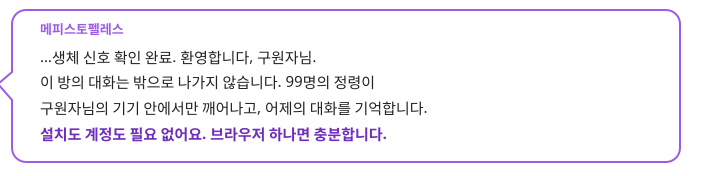
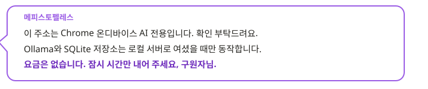
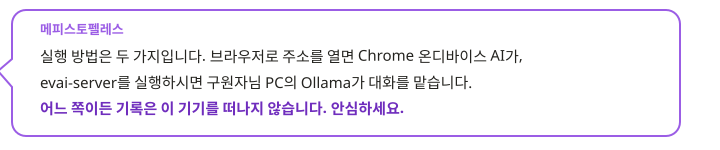
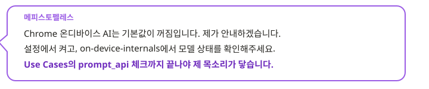
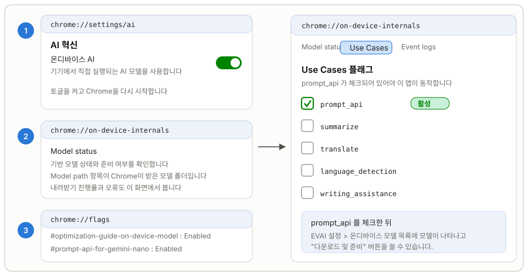
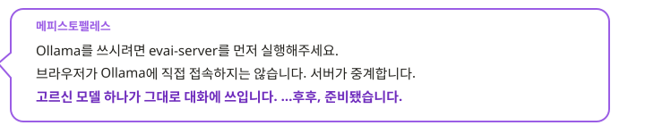

<p align="right">
   <strong>한국어</strong> &nbsp;|&nbsp;
  <a href="README.en.md"> English</a>
</p>
<p align="center">
  
</p>


<h1 align="center">EV AI Chat</h1>
<p align="center"><i>Chrome 온디바이스 AI와 내 PC의 Ollama로 돌아가는 에버소울 정령 채팅</i></p>
<p align="center"><i>로컬 서버로 열면 Ollama와 SQLite 데이터베이스까지 그대로 씁니다</i></p>

<p align="center">
  
  
  
  
  
  <br/>
  
  
  
  
  <br/>
  
  
  
  
</p>

<p align="center">
  <sub><b>1. 써 보기</b></sub><br/>
  <a href="https://github.com/GarnetRapture/evai/releases"></a>
</p>

<p align="center">
  <sub><b>2. 직접 빌드하기</b> — 포크한 뒤 Actions 탭에서 실행</sub><br/>
  <a href="https://github.com/GarnetRapture/evai/actions/workflows/build-web.yml"></a>
  <a href="https://github.com/GarnetRapture/evai/actions/workflows/build-server-windows.yml"></a>
  <a href="https://github.com/GarnetRapture/evai/actions/workflows/build-server-linux.yml"></a>
  <a href="https://github.com/GarnetRapture/evai/actions/workflows/build-server-macos.yml"></a>
</p>

<p align="center">
  <sub><b>3. 함께하기</b></sub><br/>
  <a href="https://github.com/GarnetRapture/evai/watchers"></a>
  <a href="https://github.com/GarnetRapture/evai/stargazers"></a>
  <a href="https://github.com/GarnetRapture/evai/fork"></a>
</p>

<p align="center">
  <sub>브라우저로 열면 Chrome 온디바이스 AI, 로컬 서버로 열면 내 PC의 Ollama까지 — 대화는 이 기기 밖으로 나가지 않습니다.</sub>
</p>

---

## 패치 노트

### v0.0.7 — 정령의 이야기를 목소리로 듣다

구원자님, 안녕하세요. 
이번 업데이트로 **정령들의 이야기를 처음부터 끝까지 볼 수 있게** 되었고, 그 장면에 **실제 목소리**가 입혀졌습니다. 그리고 이제부터는 완전한 로컬 서버로만 동작합니다.

**스토리**
- 저장소와 기억의 흐름 사이에 **스토리**가 새로 생겼습니다. 메인 스토리와 에픽 정령의 인연 스토리를 갤러리에서 골라 그대로 볼 수 있습니다.
- 원작 대본을 그대로 따라가며 배경, 정령의 서 있는 자리, 표정, 컷신 영상까지 장면대로 재현됩니다.
- 인연 스토리는 배드·노말·트루 엔딩으로 갈라지고, 구원자의 선택지는 직접 고르는 대로 이어집니다.
- 대사는 한국어·영어·중국어로 보여 줍니다.

**보이스와 음성 그리고 BGM**
- 스토리의 대사에 **한국어·일본어 음성**이 붙었습니다. 듣고 싶은 언어를 화면에서 바로 고를 수 있고, 자동 재생과 대화 로그도 함께 씁니다.
- 컷신 영상은 장면 흐름에 맞춰 재생됩니다.

**로컬 모델 응답**
- 모델을 고르면 그 모델이 실제로 감당하는 문맥 길이가 자동으로 기록되어, 긴 대화에서 앞부분이 잘려 나가는 일이 줄었습니다.
- 데이터베이스 읽기 경로를 다시 짜서 대화가 길어져도 응답이 느려지지 않습니다.

**완전한 로컬 서버로 전환**
- 공식 웹 서비스를 더 이상 운영하지 않습니다. 이제 `evai-server`를 실행해 내 PC에서만 씁니다.
- 정령 일러스트·대본·영상·음성은 저장소에서 분리했습니다. 서버를 처음 켜면 **없는 자산만 골라 병렬로 내려받고**, 중간에 끊겨도 다음 실행에서 이어받습니다. 파일이 엉뚱한 곳에 있으면 다시 받지 않고 제자리로 옮깁니다.
- 첫 실행에서 콘솔 언어와 음성 언어를 고르면 그 뒤로는 묻지 않습니다.

---

## 개요

<table>
<tr>
<td width="150" align="center"></td>
<td></td>
</tr>
</table>

**EverSoul AI Chat**은 내 기기 안에서만 돌아가는 서브컬처 정령 연애 채팅입니다. 99명의 정령이 각자의 이름과 성격, 말버릇 그대로 구원자님을 맞이하고, 어제 나눈 대화를 기억한 채 오늘의 이야기를 이어갑니다.

대화는 외부 서버로 전송되지 않습니다. 온디바이스 LLM이 이 기기에서 직접 답을 만들어 냅니다. 브라우저로 주소를 열면 Chrome에 내장된 Prompt API 모델이 정령의 목소리를 맡고, 기록은 이 브라우저의 IndexedDB에 남습니다. `evai-server`를 내려받아 실행하고 `http://127.0.0.1:9999/`를 열면 같은 화면에서 내 PC의 Ollama 모델을 고를 수 있고, 대화·기억·설정은 서버 폴더의 SQLite 데이터베이스에 저장됩니다. 어느 쪽이든 기록은 JSON 한 장으로 내보내고 되돌릴 수 있습니다.

정령은 대사를 흉내 내는 인형이 아닙니다. 매 턴의 장면과 속마음이 정령별 기억으로 쌓이고, 친밀도와 질투, 다른 정령과의 관계까지 데이터베이스에서 다시 계산되어 그날의 말투와 태도를 정합니다. 오래 말을 걸지 않으면 정령이 먼저 말을 걸어오기도 합니다.

99명 전원의 공식 일러스트, 대화 배경 522장, 에버톡 화면 구성까지 그대로 담았습니다. 이름과 성격과 말투는 `data/personas/`에 정령마다 한 파일씩 정리되어 있고, 한국어·영어·중국어(번체/간체) 값이 미리 준비되어 있어 언어를 바꿔도 그 정령다움은 그대로 유지됩니다.

<p align="center">
  
  
  
  
  
  
</p>

---

## 지금 바로 써 보기

<table>
<tr>
<td width="150" align="center"></td>
<td></td>
</tr>
</table>

- **로컬 서버로**: [릴리스](https://github.com/GarnetRapture/evai/releases)나 [GitHub Actions](https://github.com/GarnetRapture/evai/actions)에서 받은 패키지의 `evai-server`를 실행하고 `http://127.0.0.1:9999/`를 엽니다. 첫 실행 때 정령 자산을 자동으로 내려받고, 로컬 Ollama 모델을 고를 수 있으며, 기록은 서버 폴더의 SQLite에 저장됩니다.
- **브라우저 온디바이스 AI**: Chrome에서 `dist/`를 직접 열면 아래 "Chrome 온디바이스 AI 켜는 순서"를 마친 뒤 설치 없이 대화할 수 있습니다. 기록은 그 브라우저의 IndexedDB에 남습니다.
- **다른 브라우저**: Firefox·Edge·Whale·Brave·Opera는 온디바이스 AI를 쓸 수 없습니다. 로컬 서버와 Ollama를 함께 쓰세요.

---

## 어떤 브라우저에서 쓰나요

<table>
<tr>
<td width="150" align="center"></td>
<td></td>
</tr>
</table>

PC 데스크톱 브라우저라면 어디서든 들어올 수 있습니다. 차이는 정령의 목소리를 어느 엔진이 맡느냐뿐입니다. 모바일 웹은 지원하지 않습니다.

| 브라우저 | 대화 엔진 | 따로 준비할 것 |
| --- | --- | --- |
|  | Chrome 내장 AI(Gemini Nano, 플래그를 켜면 Gemma 4) · 로컬 서버로 열면 Ollama도 | 설정에서 모델 "다운로드 및 준비" 한 번 |
|  | 로컬 Ollama (EVAI 로컬 서버 필요) | Ollama 설치와 모델 하나, `evai-server` 실행 |
|  | 로컬 Ollama (EVAI 로컬 서버 필요) · 브라우저가 `LanguageModel` API를 노출하면 내장 AI도 목록에 나옵니다 | Ollama 설치와 모델 하나, `evai-server` 실행 |
|  | 로컬 Ollama (EVAI 로컬 서버 필요) | Ollama 설치와 모델 하나, `evai-server` 실행 |
|   | 로컬 Ollama (EVAI 로컬 서버 필요) | Ollama 설치와 모델 하나, `evai-server` 실행 |

앱은 처음 들어올 때 `/api/runtime`으로 EVAI 로컬 서버 위에서 열렸는지 확인합니다. 로컬 서버면 Ollama 연결 가이드와 모델 목록이 함께 뜨고 데이터는 SQLite에 저장됩니다. 일반 웹이면 Chrome 내장 AI만 쓰고, 초기 설정 화면이 저장소 링크와 함께 로컬 실행을 권합니다.

---

## 주요 기능

- **정령 99명, 흉내가 아닌 본인 그대로**: 이름, 등급, 종족, 직업, 생일, 좋아하는 것, 대표 대사, 에버톡 대화까지 읽어 정령마다 다른 시스템 프롬프트를 만듭니다.
- **대화 엔진 두 갈래**: Chrome 내장 모델과 내 PC의 Ollama입니다. Ollama는 EVAI 로컬 서버가 중계하며, `ollama ls`의 모든 모델이 그대로 목록에 뜨고 직접 고른 모델만 대화에 쓰입니다.
- **정령이 나와의 대화를 기억합니다**: 매 턴의 장면과 속마음이 정령별 기억으로 저장되고, 다음 대화에서 관련된 기억이 함께 전달됩니다. 정리되지 않은 기억이 8개 쌓이면 요약을 다시 만들어 시스템 프롬프트에 넣습니다.
- **한 번에 한 정령에게만 집중**: 다른 정령으로 바꾸면 이전 정령의 응답 생성을 멈추고, 모델 세션도 지금 대화 중인 하나만 유지합니다.
- **언어를 바꿔도 그 정령 그대로**: 화면 문구, 안내, 오류 메시지, 정령 원본 데이터가 한국어·영어·중국어(간체)로 함께 바뀝니다.
- **선호정령**: 목록의 별로 선호정령을 지정하면 친밀도 탭 맨 위에 올라가고, 앱을 다시 열 때 가장 먼저 선택됩니다.
- **Risu 모듈**: `.risum` 모듈을 가져와 켜고 끌 수 있으며, 켜 둔 모듈의 설명과 로어북이 시스템 프롬프트에 붙습니다.
- **기록은 내 PC에**: 로컬 서버로 열면 서버 폴더의 SQLite에, 일반 웹으로 열면 브라우저 IndexedDB에 저장됩니다. 어느 쪽이든 JSON 내보내기·불러오기와 시점 복원을 지원합니다.
- **대화 배경**: 공식 일러스트 배경 522장으로 대화창 분위기를 바꿀 수 있습니다.

<p align="center">
  
  
  
  
  
  
</p>

## 대화 모델

### Chrome 내장 AI

<table>
<tr>
<td width="150" align="center"></td>
<td></td>
</tr>
</table>

- **준비**: 설정 > 온디바이스 모델 목록에서 "다운로드 및 준비"를 누르면 Chrome이 모델을 받습니다. 사용자가 직접 클릭해야 받기가 시작됩니다.
- **모델 선택**: Gemini Nano의 크기와 GPU/CPU 실행 방식은 Chrome이 기기에 맞춰 고릅니다. `chrome://flags/#gemma4-for-built-in-ai`를 켜고 재시작하면 Gemma 4로 바뀌고, 앱은 Local State 파일로 실제 플래그 상태를 확인합니다.
- **Chrome 요구 사항**([Chrome 공식 문서](https://developer.chrome.com/docs/ai/prompt-api)): Windows 10/11, macOS 13 이상, Linux, ChromeOS(Chromebook Plus). Chrome 프로필이 있는 드라이브에 22GB 이상 여유 공간, GPU VRAM 4GB 초과 또는 RAM 16GB 이상과 CPU 4코어 이상, 데이터 무제한 네트워크가 필요합니다. Android·iOS용 Chrome에서는 동작하지 않습니다.
- **진단**: 모델 상태는 `chrome://on-device-internals`에서 볼 수 있습니다. 일반 웹 페이지는 `chrome://flags` 값을 바꿀 수 없습니다.

#### Chrome 온디바이스 AI 켜는 순서

<p align="center"></p>

1. **온디바이스 AI 켜기** — 주소창에 `chrome://settings/ai`를 입력하고 **AI 혁신 > 온디바이스 AI** 토글을 켭니다. 이 토글이 꺼져 있으면 Chrome이 모델을 내려받지 않고, 웹 페이지에 `LanguageModel`이 나타나도 항상 `unavailable`로 답합니다. 토글을 켠 뒤에는 Chrome을 완전히 종료했다가 다시 시작합니다.
2. **모델 상태 보기** — `chrome://on-device-internals`를 엽니다. **Model status** 화면에서 기반 모델의 준비 여부, 내려받기 진행률, 실패 사유를 볼 수 있고, **Model path** 항목이 Chrome이 모델 파일을 저장한 폴더입니다. 이 폴더는 앱 설정의 "Chrome 설치 모델" 연결에도 그대로 씁니다.
3. **Use Cases에서 `prompt_api` 확인** — 같은 페이지의 **Use Cases** 탭에는 기능별 플래그 목록이 있습니다. 여기서 **`prompt_api` 가 체크되어 있어야** 이 앱이 쓰는 Prompt API가 동작합니다. 체크가 없으면 모델이 준비되어 있어도 대화가 시작되지 않습니다.
4. **플래그가 필요한 경우** — 채널이나 버전에 따라 `chrome://flags/#optimization-guide-on-device-model`을 **Enabled**, `chrome://flags/#prompt-api-for-gemini-nano`를 **Enabled**로 바꾼 뒤 재시작해야 2·3단계 항목이 나타납니다. Gemma 4로 바꾸려면 `chrome://flags/#gemma4-for-built-in-ai`도 켭니다.
5. **앱에서 준비** — 위 단계가 끝나면 EVAI 설정 > 온디바이스 모델 목록에 모델이 나타납니다. "다운로드 및 준비"를 한 번 눌러 Chrome이 모델을 받게 하고, 진행률은 다시 `chrome://on-device-internals`에서 확인합니다.

저장 공간이 22GB 아래로 떨어지면 Chrome이 모델을 지웁니다. 이때는 공간을 확보하고 "다운로드 및 준비"를 다시 누르면 됩니다.

### 로컬 Ollama

<table>
<tr>
<td width="150" align="center"></td>
<td></td>
</tr>
</table>

Ollama는 EVAI 로컬 서버와 함께 씁니다. 브라우저가 Ollama에 직접 접속하지 않고, 같은 주소(`http://127.0.0.1:9999`)의 `/api/ollama` 프록시가 요청을 중계합니다. 모델은 PC 사양에 맞춰 무엇이든 쓰면 됩니다. 작은 3B 모델부터 30B, 120B 모델까지 Ollama가 돌릴 수 있으면 앱도 씁니다.

1. [ollama.com](https://ollama.com/download)에서 Ollama를 설치하고 실행합니다.
2. 쓸 모델을 받습니다.

   ```bash
   ollama --version
   ollama pull <모델이름:태그>
   ```

   이미 가지고 있는 GGUF 파일로 모델을 만들 수도 있습니다. 윈도우 PowerShell 기준입니다.

   ```powershell
   Set-Content "$env:TEMP\Modelfile.evai" 'FROM D:\model\내모델.gguf'
   ollama create 내모델이름 -f "$env:TEMP\Modelfile.evai"
   Remove-Item "$env:TEMP\Modelfile.evai" -Force
   ```

3. 모델을 한 번 실행해 보고 목록을 확인합니다. 앱은 설정의 모델 목록에서 직접 고른 모델만 씁니다.

   ```bash
   ollama run 내모델이름
   ollama ls
   ollama ps
   ```

4. 웹 빌드와 같은 폴더에서 `evai-server`를 실행하고 `http://127.0.0.1:9999/`를 엽니다. 초기 설정 화면(또는 설정 > 로컬 Ollama 모델 목록)에서 "연결 확인"을 누르고, 쓸 모델을 고르면 그 모델로 고정됩니다.

**외부 접속 허용을 확인하세요.** Ollama 앱 설정의 "Expose Ollama to the network"를 켜거나, 환경 변수 `OLLAMA_HOST`를 `0.0.0.0:11434`로 지정한 뒤 Ollama를 다시 실행합니다. `OLLAMA_ORIGINS`는 더 이상 필요하지 않습니다. 브라우저가 Ollama를 직접 부르지 않고 EVAI 로컬 서버가 대신 요청하기 때문입니다.

```powershell
[Environment]::SetEnvironmentVariable('OLLAMA_HOST', '0.0.0.0:11434', 'User')
```

macOS는 `launchctl setenv OLLAMA_HOST "0.0.0.0:11434"`, systemd를 쓰는 리눅스는 `systemctl edit ollama.service`에 `Environment="OLLAMA_HOST=0.0.0.0:11434"`를 넣고 Ollama를 다시 시작합니다. Ollama 주소가 기본값과 다르면 설정 > 로컬 Ollama 모델 목록의 "Ollama 주소"에 입력하면 서버가 그 주소로 중계합니다.

---

## 로컬 서버 실행기 (evai-server)

윈도우, 리눅스, macOS에서 모두 돌아갑니다. 웹 빌드 결과물(`index.html`, `assets/`)과 데이터베이스 폴더(`evai-database/`)가 실행 파일과 같은 폴더에 있어야 합니다. 배포 패키지에는 스키마만 들어 있는 빈 `evai.sqlite3`가 함께 들어갑니다.

| OS | 실행 파일 | 실행 방법 |
| --- | --- | --- |
|  x86_64 | `evai-server.exe` | 더블클릭하면 명령 창이 뜹니다. 창을 닫으면 서버도 꺼집니다. |
|  x86_64 | `evai-server` | 터미널에서 `./evai-server` |
|  Apple Silicon | `evai-server` | 터미널에서 `./evai-server`. 인터넷에서 받은 파일이면 처음 한 번 `xattr -d com.apple.quarantine evai-server`가 필요할 수 있습니다. |

```text
EVAI local server
root: C:\EVAI
database: C:\EVAI\evai-database\evai.sqlite3
open: http://127.0.0.1:9999/
close this window to stop the server.
```

- 항상 실행 파일이 있는 폴더를 기준으로 파일을 서빙합니다. 어디서 실행했든 상관없고, 그 폴더에 `index.html`이 없으면 바로 종료합니다.
- `127.0.0.1`에만 열리므로 다른 PC에서는 접속할 수 없습니다. Host 헤더가 `127.0.0.1:포트`나 `localhost:포트`가 아니면 거절합니다.
- 기본 포트는 `9999`이고 `evai-server --port 48000`처럼 바꿀 수 있습니다.
- 앱이 쓰는 `Cross-Origin-Opener-Policy: same-origin`, `Cross-Origin-Embedder-Policy: require-corp` 헤더를 개발 서버와 똑같이 붙입니다.
- 폴더 밖 경로로 나가는 요청은 막고, 정적 파일은 `GET`과 `HEAD`만 받습니다. `evai-database` 폴더는 서빙하지 않습니다.
- `/api/runtime`은 서버 정보(버전, SQLite 버전, 데이터베이스 경로)를 돌려주고, `/api/storage/*`는 SQLite 읽기·쓰기·복원·초기화를, `/api/ollama/*`는 Ollama 프록시를 담당합니다. `/api/*` 요청은 Origin이 `http://127.0.0.1:포트` 또는 `http://localhost:포트`일 때만 받습니다.

GitHub Actions에 OS별 서버 빌드 워크플로(Build Server Windows, Build Server Linux, Build Server macOS)가 따로 있습니다. 내 OS 워크플로를 돌리면 웹 빌드와 실행 파일을 한 묶음으로 만들어 주니, 압축을 풀고 실행하면 끝입니다.

## GitHub Actions로 직접 빌드하기

포크하면 워크플로 파일도 같이 따라옵니다. 내 포크의 **Actions** 탭에서 버튼만 누르면 GitHub가 빌드해서 zip으로 올려 줍니다. PC에 Node.js나 컴파일러를 설치할 필요가 없습니다.

<p align="center">
  <a href="https://github.com/GarnetRapture/evai/fork"></a>
  <a href="https://github.com/GarnetRapture/evai/actions/workflows/build-web.yml"></a>
  <a href="https://github.com/GarnetRapture/evai/actions/workflows/build-server-windows.yml"></a>
  <a href="https://github.com/GarnetRapture/evai/actions/workflows/build-server-linux.yml"></a>
  <a href="https://github.com/GarnetRapture/evai/actions/workflows/build-server-macos.yml"></a>
</p>

| 워크플로 | 결과물 | 쓰는 곳 |
| --- | --- | --- |
| [Build Web](.github/workflows/build-web.yml) | `evai-web-v<버전>-<커밋7자리>.zip` (`dist/`) | 정적 호스팅에 올릴 때 (Chrome 온디바이스 AI 전용) |
| [Build Server Windows](.github/workflows/build-server-windows.yml) | `evai-server-windows-x86_64-v<버전>-<커밋7자리>.zip` (`dist/` + `evai-server.exe` + `evai-database/`) | 윈도우 PC에서 실행기로 열 때 |
| [Build Server Linux](.github/workflows/build-server-linux.yml) | `evai-server-linux-x86_64-v<버전>-<커밋7자리>.tar.gz` (`dist/` + `evai-server` + `evai-database/`) | 리눅스 PC에서 실행기로 열 때 |
| [Build Server macOS](.github/workflows/build-server-macos.yml) | `evai-server-macos-arm64-v<버전>-<커밋7자리>.tar.gz` (`dist/` + `evai-server` + `evai-database/`) | Apple Silicon Mac에서 실행기로 열 때 |

### 1단계 — 내 포크에서 Actions 켜기

포크된 저장소는 워크플로가 꺼진 상태로 시작합니다. 내 포크의 **Actions** 탭에 들어가 초록 버튼 **`I understand my workflows, go ahead and enable them`** 을 한 번 누르면 켜집니다. 포크당 최초 한 번이면 끝입니다.

<p align="center">
  
</p>

### 2단계 — `Run workflow` 버튼 누르기

왼쪽 목록에서 **Build Web**이나 내 OS에 맞는 **Build Server Windows / Linux / macOS**를 고르고, 오른쪽의 **`Run workflow`** 를 연 다음 초록 **`Run workflow`** 버튼을 누릅니다. 입력할 값은 없고 브랜치는 기본값 그대로 두면 됩니다.

<p align="center">
  
</p>

### 3단계 — 완성된 묶음 내려받기

실행이 끝나면 초록 체크가 뜹니다. 그 실행을 눌러 들어가 맨 아래 **Artifacts**에서 필요한 파일을 받으면 됩니다. 서버 워크플로의 묶음은 압축을 풀고 실행 파일만 실행하면 바로 쓸 수 있는 구조(`index.html` · `assets/` · `evai-server` · `evai-database/`)입니다.

<p align="center">
  
</p>

### 워크플로가 실제로 하는 일

| 워크플로 | 러너 | 하는 일 |
| --- | --- | --- |
| Build Web | `ubuntu-latest` + Node.js 24 | `npm install` → `npm run build`(`tsc -b` + `vite build`) → `dist/`를 zip으로 업로드 |
| Build Server Windows | `windows-latest` | 웹 빌드 후 xmake 설치 → `sh server/build.sh`(MSVC, C++26) → `dist/`에 실행 파일과 `evai-database/`를 합쳐 zip 업로드 |
| Build Server Linux | `ubuntu-24.04` | 웹 빌드 후 xmake 설치 → `sh server/build.sh` → tar.gz 업로드(실행 권한 유지) |
| Build Server macOS | `macos-15` (Apple Silicon) | 웹 빌드 후 xmake 설치 → `sh server/build.sh` → tar.gz 업로드(실행 권한 유지) |

포장 단계에서 WAL·shm 임시 파일, `evai-server.ini`, 오류 로그, 소스맵을 제거하고, 빌드 증분 산출물(`build/`, `.xmake/`, `server/build/`)도 정리합니다.

### 알아둘 점

- 워크플로를 수동 실행하는 **`Run workflow` 버튼은 기본 브랜치에 워크플로 파일이 있을 때만** 나타납니다([GitHub 공식 문서](https://docs.github.com/en/actions/how-tos/manage-workflow-runs/manually-run-a-workflow)). 포크 직후에는 그대로 있으니 신경 쓰지 않아도 됩니다.
- 빌드는 각자의 저장소에서 각자의 계정으로 돌아갑니다. 공개 저장소에서 GitHub 제공 표준 러너를 쓰면 [Actions 사용료는 무료](https://docs.github.com/en/billing/concepts/product-billing/github-actions)입니다. 비공개 포크는 계정 플랜의 무료 분에서 차감됩니다.
- 공식 Releases에는 빌드 파일을 첨부하지 않습니다. 실행 파일과 웹 파일은 위 워크플로로 직접 받아 주세요.
- 안드로이드 앱 빌드 워크플로는 **준비 중(대기)** 입니다. 추가되면 위 목록에 함께 올라갑니다.

---

## 안드로이드 앱

<p align="center">
  
</p>

`android/`에는 `@evai/android` React Native 모바일 전용 앱을 구현 중입니다. Android 앱은 원본 llama.cpp와 기기 내 GGUF 모델을 사용하도록 설계되었으며 Google AI/ML 라이브러리를 사용하지 않습니다. 현재 네이티브 연결과 화면은 개발 중이고 빌드·기기 동작은 검증되지 않았습니다. 구현 범위와 남은 작업은 [Android 전용 작업 트래킹](android/ANDROID_TRACKING.md)에 기록합니다.

## 정령 자산 내려받기

정령 일러스트·스토리 대본·컷신 영상·음성·BGM·효과음은 용량이 커서(약 4.58 GB) 이 저장소에 담지 않고 공개 데이터셋으로 분리했습니다.

**로컬 서버를 쓰면 따로 받을 필요가 없습니다.** `evai-server.exe`를 처음 실행하면 콘솔 언어와 음성 언어(한국어 / 일본어 / 둘 다 / 받지 않음)를 물은 뒤, 없는 파일만 골라 병렬로 내려받고 완료되면 서비스를 엽니다. 중간에 끊겨도 다음 실행에서 이어받고, 파일이 엉뚱한 위치에 있으면 다시 받지 않고 제자리로 옮깁니다.

| 받는 위치 | 들어 있는 것 |
| --- | --- |
| `data/dataset/` | 정령 프로필과 대사 JSON |
| `data/story/` | 메인·인연 스토리 대본 |
| `data/story-media/` | 스토리 컷신 영상, 한국어·일본어 음성, BGM·효과음 |
| `data/eversoul-assets/` | 정령 일러스트, 배경, UI 이미지 |

## 기술 문서

코드 구조와 빌드 절차는 문서로 옮겼습니다.

- [아키텍처와 기술 스택](docs/architecture.ko.md) — 도메인 구성, 저장소 계층, 프롬프트 조립, 로컬 서버 API
- [빌드와 배포](docs/build.ko.md) — 개발 실행, 웹/서버 빌드, GitHub Actions 사용법
- [정령 데이터 스키마](docs/persona-data.ko.md) — `data/personas/*.json` 필드와 버전 관리 규칙

---

## 전체 정령 갤러리 (99종)

`data/personas/*.json` 99개 파일을 전부 살펴서 정령 그림과 한국어(ko)·영어(en)·중국어 간체(zh_cn) 이름을 실제 데이터 그대로 나열한 도감입니다. 그림 폴더 이름은 `src/domains/persona/logic.ts`의 `resolveSpiritAssetFolder`가 찾는 방식 그대로 가져왔습니다(게임 내 표시명과 실제 그림 폴더명이 다른 27명은 `explicitAssetFolders` 매핑을, 그림 파일 접두사가 폴더명과 다른 Canney·Casper·Irene은 `assetFilePrefixes` 매핑을 그대로 따랐습니다).

<table>
<tr>
<td align="center"><br/><sub>아야메<br/>Ayame<br/>綾織</sub></td>
<td align="center"><br/><sub>아야메(츠쿠요미)<br/>Ayame (Tsukuyomi)<br/>綾織（月讀）</sub></td>
<td align="center"><br/><sub>아키<br/>Aki<br/>秋</sub></td>
<td align="center"><br/><sub>알리샤<br/>Alisha<br/>艾麗西雅</sub></td>
<td align="center"><br/><sub>아드리안<br/>Adrianne<br/>阿德里安</sub></td>
<td align="center"><br/><sub>아이라<br/>Aira<br/>艾拉</sub></td>
<td align="center"><br/><sub>클라우디아(대천사)<br/>Claudia (Archangel)<br/>克勞迪婭（大天使）</sub></td>
<td align="center"><br/><sub>클레르<br/>Claire<br/>克萊兒</sub></td>
</tr>
<tr>
<td align="center"><br/><sub>셰리<br/>Cherrie<br/>雪莉</sub></td>
<td align="center"><br/><sub>클로이<br/>Chloe<br/>克羅伊</sub></td>
<td align="center"><br/><sub>셰리(낭만)<br/>Cherrie (Romantic)<br/>雪莉（浪漫）</sub></td>
<td align="center"><br/><sub>클라라<br/>Clara<br/>克拉拉</sub></td>
<td align="center"><br/><sub>클라우디아<br/>Claudia<br/>克勞迪婭</sub></td>
<td align="center"><br/><sub>가넷<br/>Garnet<br/>佳妮特</sub></td>
<td align="center"><br/><sub>캐서린(광휘)<br/>Catherine (Radiance)<br/>凱瑟琳（光輝）</sub></td>
<td align="center"><br/><sub>도미니크<br/>Dominique<br/>多米尼克</sub></td>
</tr>
<tr>
<td align="center"><br/><sub>에일린<br/>Eileen<br/>艾琳</sub></td>
<td align="center"><br/><sub>이나<br/>Ina<br/>伊娜</sub></td>
<td align="center"><br/><sub>헤이즐<br/>Hazel<br/>黑伊茲爾</sub></td>
<td align="center"><br/><sub>캐서린<br/>Catherine<br/>凱瑟琳</sub></td>
<td align="center"><br/><sub>도라<br/>Dora<br/>朵菈</sub></td>
<td align="center"><br/><sub>가넷(열락)<br/>Garnet (Rapture)<br/>佳妮特（狂喜）</sub></td>
<td align="center"><br/><sub>홍란<br/>Honglan<br/>紅蘭</sub></td>
<td align="center"><br/><sub>한울<br/>Hanul<br/>韓羽</sub></td>
</tr>
<tr>
<td align="center"><br/><sub>이디스<br/>Edith<br/>伊迪絲</sub></td>
<td align="center"><br/><sub>플린<br/>Flynn<br/>弗林</sub></td>
<td align="center"><br/><sub>에루샤<br/>Erusha<br/>艾魯莎</sub></td>
<td align="center"><br/><sub>홍란(무쌍)<br/>Honglan (Peerless)<br/>紅蘭（無雙）</sub></td>
<td align="center"><br/><sub>에리카<br/>Erika<br/>艾麗卡</sub></td>
<td align="center"><br/><sub>하루(카무이)<br/>Haru (Kamuy)<br/>河路（神威）</sub></td>
<td align="center"><br/><sub>카넬리안<br/>Carnelian<br/>卡內莉安</sub></td>
<td align="center"><br/><sub>카렌<br/>Karen<br/>卡倫</sub></td>
</tr>
<tr>
<td align="center"><br/><sub>조앤<br/>Joanne<br/>瓊</sub></td>
<td align="center"><br/><sub>다프네<br/>Daphne<br/>達芙妮</sub></td>
<td align="center"><br/><sub>이브<br/>Eve<br/>夏娃</sub></td>
<td align="center"><br/><sub>제이드<br/>Jade<br/>潔依德</sub></td>
<td align="center"><br/><sub>토키사키 쿠루미<br/>Kurumi Tokisaki<br/>時崎狂三</sub></td>
<td align="center"><br/><sub>재클린<br/>Jacqueline<br/>潔克琳</sub></td>
<td align="center"><br/><sub>라리마<br/>Larimar<br/>拉利瑪</sub></td>
<td align="center"><br/><sub>하루<br/>Haru<br/>河路</sub></td>
</tr>
<tr>
<td align="center"><br/><sub>지호<br/>Jiho<br/>智河</sub></td>
<td align="center"><br/><sub>르웨인<br/>Lewayne<br/>樂溫</sub></td>
<td align="center"><br/><sub>브라이스<br/>Bryce<br/>布萊斯</sub></td>
<td align="center"><br/><sub>칸나<br/>Kanna<br/>坎納</sub></td>
<td align="center"><br/><sub>지호(미르)<br/>Jiho (Mir)<br/>智河（米爾）</sub></td>
<td align="center"><br/><sub>벨레드<br/>Beleth<br/>貝萊德</sub></td>
<td align="center"><br/><sub>린지<br/>Linzy<br/>琳賽</sub></td>
<td align="center"><br/><sub>라우라<br/>Laura<br/>蘿拉</sub></td>
</tr>
<tr>
<td align="center"><br/><sub>린지(타나토스)<br/>Linzy (Thanatos)<br/>琳賽（桑納托斯）</sub></td>
<td align="center"><br/><sub>릴리트<br/>Lilith<br/>莉莉絲</sub></td>
<td align="center"><br/><sub>리젤로테<br/>Lizelotte<br/>莉澤洛特</sub></td>
<td align="center"><br/><sub>루테<br/>Lute<br/>魯特</sub></td>
<td align="center"><br/><sub>마농<br/>Manon<br/>瑪儂</sub></td>
<td align="center"><br/><sub>멜피스<br/>Melfice<br/>梅爾菲斯</sub></td>
<td align="center"><br/><sub>메피스토펠레스<br/>Mephistopheles<br/>梅菲斯托佩萊斯</sub></td>
<td align="center"><br/><sub>메릴<br/>Meryl<br/>梅莉兒</sub></td>
</tr>
<tr>
<td align="center"><br/><sub>미카<br/>Mica<br/>米卡</sub></td>
<td align="center"><br/><sub>메피스토펠레스(여명)<br/>Mephistopheles (Dawn)<br/>梅菲斯托佩萊斯（黎明）</sub></td>
<td align="center"><br/><sub>미리암<br/>Miriam<br/>米里昂</sub></td>
<td align="center"><br/><sub>무명<br/>Nameless<br/>無名</sub></td>
<td align="center"><br/><sub>나이아<br/>Naiah<br/>娜伊雅</sub></td>
<td align="center"><br/><sub>나오미<br/>Naomi<br/>直美</sub></td>
<td align="center"><br/><sub>미리암(잔영)<br/>Miriam (Afterimage)<br/>米里昂（殘影）</sub></td>
<td align="center"><br/><sub>니콜<br/>Nicole<br/>妮可</sub></td>
</tr>
<tr>
<td align="center"><br/><sub>니아<br/>Nia<br/>妮亞</sub></td>
<td align="center"><br/><sub>오닉스<br/>Onyx<br/>歐妮絲</sub></td>
<td align="center"><br/><sub>니니<br/>Nini<br/>妮妮</sub></td>
<td align="center"><br/><sub>오토하<br/>Otoha<br/>乙葉</sub></td>
<td align="center"><br/><sub>페트라(각혼)<br/>Petra (Awakened Soul)<br/>佩特拉（覺魂）</sub></td>
<td align="center"><br/><sub>레베카<br/>Rebecca<br/>瑞貝卡</sub></td>
<td align="center"><br/><sub>로제<br/>Rose<br/>蘿絲</sub></td>
<td align="center"><br/><sub>르네<br/>Renee<br/>勒內</sub></td>
</tr>
<tr>
<td align="center"><br/><sub>리타<br/>Rita<br/>麗塔</sub></td>
<td align="center"><br/><sub>로제(홍염)<br/>Rose (Prominence)<br/>蘿絲（紅焰）</sub></td>
<td align="center"><br/><sub>르네(백은)<br/>Renee (Argent)<br/>勒內（白銀）</sub></td>
<td align="center"><br/><sub>타샤<br/>Tasha<br/>塔莎</sub></td>
<td align="center"><br/><sub>페트라<br/>Petra<br/>佩特拉</sub></td>
<td align="center"><br/><sub>프림<br/>Prim<br/>弗里姆</sub></td>
<td align="center"><br/><sub>사쿠요(업화)<br/>Sakuyo (Inferno)<br/>櫻世（業火）</sub></td>
<td align="center"><br/><sub>순이<br/>Soonie<br/>順伊</sub></td>
</tr>
<tr>
<td align="center"><br/><sub>샤링<br/>Sharinne<br/>夏琳</sub></td>
<td align="center"><br/><sub>비올레트<br/>Violette<br/>薇奧蕾特</sub></td>
<td align="center"><br/><sub>야토가미 토카<br/>Tohka Yatogami<br/>夜刀神十香</sub></td>
<td align="center"><br/><sub>탈리아<br/>Talia<br/>塔利亞</sub></td>
<td align="center"><br/><sub>시그리드<br/>Sigrid<br/>希格莉德</sub></td>
<td align="center"><br/><sub>시하<br/>Seeha<br/>西荷</sub></td>
<td align="center"><br/><sub>루리<br/>Ruri<br/>魯莉</sub></td>
<td align="center"><br/><sub>바이스<br/>Weiss<br/>拜斯</sub></td>
</tr>
<tr>
<td align="center"><br/><sub>벨라나<br/>Velanna<br/>貝拉納</sub></td>
<td align="center"><br/><sub>비비안<br/>Vivienne<br/>薇薇安</sub></td>
<td align="center"><br/><sub>소연<br/>Xiaolian<br/>小蓮</sub></td>
<td align="center"><br/><sub>유리아<br/>Yuria<br/>尤里婭</sub></td>
<td align="center"><br/><sub>사쿠요<br/>Sakuyo<br/>櫻世</sub></td>
<td align="center"><br/><sub>유리아(아폴리온)<br/>Yuria (Apollyon)<br/>尤里婭（阿巴頓）</sub></td>
<td align="center"><br/><sub>웨리<br/>Wheri<br/>威里</sub></td>
<td align="center"><br/><sub>Canney<br/>Canney<br/>Canney</sub></td>
</tr>
<tr>
<td align="center"><br/><sub>Casper<br/>Casper<br/>Casper</sub></td>
<td align="center"><br/><sub>Irene<br/>Irene<br/>Irene</sub></td>
<td align="center"><br/><sub>Pixie<br/>Pixie<br/>Pixie</sub></td>
<td></td>
<td></td>
<td></td>
<td></td>
<td></td>
</tr>
</table>

정령마다 그림이 한 장으로 끝나지 않습니다. `base`(평소 모습), `costume`(의상), `raid`, `gacha`, `srg` 폴더로 나뉘어서 같은 정령이라도 여러 장의 그림이 준비되어 있습니다. 앱은 `base`·`costume`·`raid` 그림을 스킨으로 보여주며, 정령마다 고른 스킨은 설정에 저장됩니다.

<p align="center">
  
  
  
  
</p>
<p align="center"><sub>아드리안 폴더에 있는 그림들 — 왼쪽부터 base, costume, gacha, raid</sub></p>

<p align="center">
  <sub>© Kakao Games · Nine Ark. 위 일러스트와 정령 프로필, 대화 배경, 음성의 저작권은 <b>에버소울</b> 원저작권자에게 있습니다.<br/>
  이 저장소는 해당 저작물의 권리를 주장하지 않으며, 비상업적 팬 프로젝트로만 사용합니다. 자세한 범위는 아래 라이선스를 보십시오.</sub>
</p>

---

## 라이선스

이 저장소의 **Apache License 2.0**은 이 프로젝트가 직접 작성한 소스 코드(`src/`, `server/`)에만 적용됩니다. 아래 제3자 저작물에 대한 권리는 이 프로젝트에 없습니다.

- **Gemini Nano, Gemma 4** — Google이 Chrome을 통해 제공하는 모델입니다. 이 저장소는 모델 가중치를 담거나 재배포하지 않고, 모델은 사용자 PC의 Chrome이 직접 받아서 관리합니다.
- **Ollama와 Ollama에서 쓰는 모델** — 사용자가 직접 설치하며, 각 모델은 그 모델의 라이선스를 따릅니다. 이 저장소는 어떤 모델도 포함하지 않습니다.
- **에버소울 게임 리소스** — 정령 일러스트, 대화 배경, 정령 프로필 원본 데이터, 음성의 저작권은 원저작권자에게 있습니다. 이 프로젝트는 해당 저작물의 권리를 주장하지 않으며 비상업적 팬 프로젝트로 이용합니다.

<p align="center">
  <a href="https://github.com/GarnetRapture/evai/watchers"></a>
  <a href="https://github.com/GarnetRapture/evai/stargazers"></a>
  <a href="https://github.com/GarnetRapture/evai/fork"></a>
</p>
