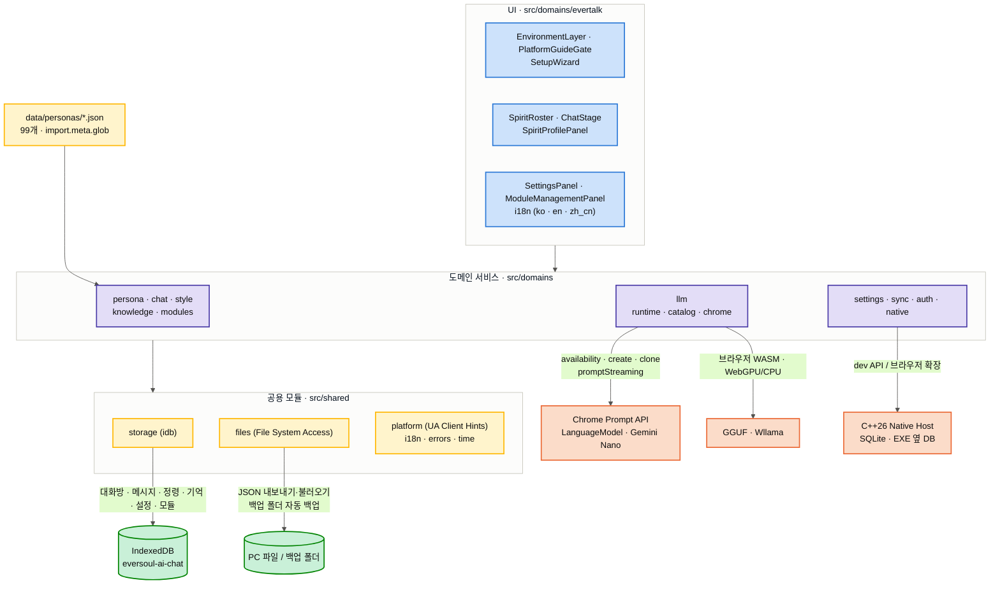

<p align="right">
   <strong>한국어</strong> &nbsp;|&nbsp;
  <a href="README.en.md"> English</a>
</p>

<p align="center">
  
</p>

<h1 align="center">EverSoul AI Chat</h1>
<p align="center"><i>브라우저 로컬 AI와 선택형 네이티브 SQLite를 연결한 서브컬처 인연 채팅</i></p>

<p align="center">
  
  
  
  
  
  
  
  
  
  
</p>

<p align="center">
  <a href="https://ai.everlib.pro/"></a>
  <a href="https://github.com/GarnetRapture/evai/fork"></a>
  <a href="https://github.com/GarnetRapture/evai/stargazers"></a>
  <a href="https://github.com/GarnetRapture/evai/watchers"></a>
</p>

<p align="center">
  <sub>PC Chrome의 Prompt API 또는 최신 데스크톱 브라우저의 GGUF 로컬 모델을 사용하며, 네이티브 SQLite 확장은 고객이 선택합니다.</sub>
</p>

---

## 🌟 개요

**EverSoul AI Chat**은 에버소울을 간직할 새로운 AI 채팅 프로젝트입니다. 정령들의 기억을 보존한다는 의미로 만들었습니다. 에버소울에 등장하는 정령 99명을 실제 게임 데이터 그대로 불러와, 각자의 성격과 말투로 자유롭게 대화할 수 있습니다.

이 프로젝트는 로컬 우선 웹 앱입니다. Chrome에서는 내장 Prompt API를, 최신 데스크톱 브라우저에서는 GGUF/Wllama를 사용할 수 있습니다. 대화·기억·설정은 IndexedDB에 저장되고, 고객이 네이티브 확장을 선택하면 EXE 옆 SQLite에도 미러링됩니다. 저장된 데이터는 PC 파일로 내보내거나 PC 폴더에 자동 백업할 수 있습니다.

정령 99명 전원의 실제 게임 그림, 대화 배경 522장, 에버톡 화면에서 쓰던 UI까지 프로젝트 안에 그대로 담아뒀습니다. 각 정령의 이름과 성격, 말투는 `data/personas/`에 정령마다 하나씩 정리되어 있고, 한국어·영어·중국어(번체/간체) 언어별 값이 미리 준비되어 있어서 언어를 바꿔도 그 정령다움은 그대로 유지됩니다.

<p align="center">
  
  
  
  
  
  
</p>

---

## 🎨 전체 정령 갤러리 (99종)

`data/personas/*.json` 99개 파일을 전부 살펴서 정령 그림과 한국어(ko)·영어(en)·중국어 간체(zh_cn) 이름을 실제 데이터 그대로 나열한 도감입니다. 그림 폴더 이름은 `src/domains/persona/logic.ts`의 `resolveSpiritAssetFolder`가 찾는 방식 그대로 가져왔습니다(게임 내 표시명과 실제 그림 폴더명이 다른 27명은 `explicitAssetFolders` 매핑을, 그림 파일 접두사가 폴더명과 다른 Canney·Casper·Irene은 `assetFilePrefixes` 매핑을 그대로 따랐습니다).

<table>
<tr>
<td align="center"><br/><sub>아야메<br/>Ayame<br/>綾織</sub></td>
<td align="center"><br/><sub>아야메(츠쿠요미)<br/>Ayame (Tsukuyomi)<br/>綾織（月讀）</sub></td>
<td align="center"><br/><sub>아키<br/>Aki<br/>秋</sub></td>
<td align="center"><br/><sub>알리샤<br/>Alisha<br/>艾麗西雅</sub></td>
<td align="center"><br/><sub>아드리안<br/>Adrianne<br/>阿德里安</sub></td>
<td align="center"><br/><sub>아이라<br/>Aira<br/>艾拉</sub></td>
<td align="center"><br/><sub>클라우디아(대천사)<br/>Claudia (Archangel)<br/>克勞迪婭（大天使）</sub></td>
<td align="center"><br/><sub>클레르<br/>Claire<br/>克萊兒</sub></td>
</tr>
<tr>
<td align="center"><br/><sub>셰리<br/>Cherrie<br/>雪莉</sub></td>
<td align="center"><br/><sub>클로이<br/>Chloe<br/>克羅伊</sub></td>
<td align="center"><br/><sub>셰리(낭만)<br/>Cherrie (Romantic)<br/>雪莉（浪漫）</sub></td>
<td align="center"><br/><sub>클라라<br/>Clara<br/>克拉拉</sub></td>
<td align="center"><br/><sub>클라우디아<br/>Claudia<br/>克勞迪婭</sub></td>
<td align="center"><br/><sub>가넷<br/>Garnet<br/>佳妮特</sub></td>
<td align="center"><br/><sub>캐서린(광휘)<br/>Catherine (Radiance)<br/>凱瑟琳（光輝）</sub></td>
<td align="center"><br/><sub>도미니크<br/>Dominique<br/>多米尼克</sub></td>
</tr>
<tr>
<td align="center"><br/><sub>에일린<br/>Eileen<br/>艾琳</sub></td>
<td align="center"><br/><sub>이나<br/>Ina<br/>伊娜</sub></td>
<td align="center"><br/><sub>헤이즐<br/>Hazel<br/>黑伊茲爾</sub></td>
<td align="center"><br/><sub>캐서린<br/>Catherine<br/>凱瑟琳</sub></td>
<td align="center"><br/><sub>도라<br/>Dora<br/>朵菈</sub></td>
<td align="center"><br/><sub>가넷(열락)<br/>Garnet (Rapture)<br/>佳妮特（狂喜）</sub></td>
<td align="center"><br/><sub>홍란<br/>Honglan<br/>紅蘭</sub></td>
<td align="center"><br/><sub>한울<br/>Hanul<br/>韓羽</sub></td>
</tr>
<tr>
<td align="center"><br/><sub>이디스<br/>Edith<br/>伊迪絲</sub></td>
<td align="center"><br/><sub>플린<br/>Flynn<br/>弗林</sub></td>
<td align="center"><br/><sub>에루샤<br/>Erusha<br/>艾魯莎</sub></td>
<td align="center"><br/><sub>홍란(무쌍)<br/>Honglan (Peerless)<br/>紅蘭（無雙）</sub></td>
<td align="center"><br/><sub>에리카<br/>Erika<br/>艾麗卡</sub></td>
<td align="center"><br/><sub>하루(카무이)<br/>Haru (Kamuy)<br/>河路（神威）</sub></td>
<td align="center"><br/><sub>카넬리안<br/>Carnelian<br/>卡內莉安</sub></td>
<td align="center"><br/><sub>카렌<br/>Karen<br/>卡倫</sub></td>
</tr>
<tr>
<td align="center"><br/><sub>조앤<br/>Joanne<br/>瓊</sub></td>
<td align="center"><br/><sub>다프네<br/>Daphne<br/>達芙妮</sub></td>
<td align="center"><br/><sub>이브<br/>Eve<br/>夏娃</sub></td>
<td align="center"><br/><sub>제이드<br/>Jade<br/>潔依德</sub></td>
<td align="center"><br/><sub>토키사키 쿠루미<br/>Kurumi Tokisaki<br/>時崎狂三</sub></td>
<td align="center"><br/><sub>재클린<br/>Jacqueline<br/>潔克琳</sub></td>
<td align="center"><br/><sub>라리마<br/>Larimar<br/>拉利瑪</sub></td>
<td align="center"><br/><sub>하루<br/>Haru<br/>河路</sub></td>
</tr>
<tr>
<td align="center"><br/><sub>지호<br/>Jiho<br/>智河</sub></td>
<td align="center"><br/><sub>르웨인<br/>Lewayne<br/>樂溫</sub></td>
<td align="center"><br/><sub>브라이스<br/>Bryce<br/>布萊斯</sub></td>
<td align="center"><br/><sub>칸나<br/>Kanna<br/>坎納</sub></td>
<td align="center"><br/><sub>지호(미르)<br/>Jiho (Mir)<br/>智河（米爾）</sub></td>
<td align="center"><br/><sub>벨레드<br/>Beleth<br/>貝萊德</sub></td>
<td align="center"><br/><sub>린지<br/>Linzy<br/>琳賽</sub></td>
<td align="center"><br/><sub>라우라<br/>Laura<br/>蘿拉</sub></td>
</tr>
<tr>
<td align="center"><br/><sub>린지(타나토스)<br/>Linzy (Thanatos)<br/>琳賽（桑納托斯）</sub></td>
<td align="center"><br/><sub>릴리트<br/>Lilith<br/>莉莉絲</sub></td>
<td align="center"><br/><sub>리젤로테<br/>Lizelotte<br/>莉澤洛特</sub></td>
<td align="center"><br/><sub>루테<br/>Lute<br/>魯特</sub></td>
<td align="center"><br/><sub>마농<br/>Manon<br/>瑪儂</sub></td>
<td align="center"><br/><sub>멜피스<br/>Melfice<br/>梅爾菲斯</sub></td>
<td align="center"><br/><sub>메피스토펠레스<br/>Mephistopheles<br/>梅菲斯托佩萊斯</sub></td>
<td align="center"><br/><sub>메릴<br/>Meryl<br/>梅莉兒</sub></td>
</tr>
<tr>
<td align="center"><br/><sub>미카<br/>Mica<br/>米卡</sub></td>
<td align="center"><br/><sub>메피스토펠레스(여명)<br/>Mephistopheles (Dawn)<br/>梅菲斯托佩萊斯（黎明）</sub></td>
<td align="center"><br/><sub>미리암<br/>Miriam<br/>米里昂</sub></td>
<td align="center"><br/><sub>무명<br/>Nameless<br/>無名</sub></td>
<td align="center"><br/><sub>나이아<br/>Naiah<br/>娜伊雅</sub></td>
<td align="center"><br/><sub>나오미<br/>Naomi<br/>直美</sub></td>
<td align="center"><br/><sub>미리암(잔영)<br/>Miriam (Afterimage)<br/>米里昂（殘影）</sub></td>
<td align="center"><br/><sub>니콜<br/>Nicole<br/>妮可</sub></td>
</tr>
<tr>
<td align="center"><br/><sub>니아<br/>Nia<br/>妮亞</sub></td>
<td align="center"><br/><sub>오닉스<br/>Onyx<br/>歐妮絲</sub></td>
<td align="center"><br/><sub>니니<br/>Nini<br/>妮妮</sub></td>
<td align="center"><br/><sub>오토하<br/>Otoha<br/>乙葉</sub></td>
<td align="center"><br/><sub>페트라(각혼)<br/>Petra (Awakened Soul)<br/>佩特拉（覺魂）</sub></td>
<td align="center"><br/><sub>레베카<br/>Rebecca<br/>瑞貝卡</sub></td>
<td align="center"><br/><sub>로제<br/>Rose<br/>蘿絲</sub></td>
<td align="center"><br/><sub>르네<br/>Renee<br/>勒內</sub></td>
</tr>
<tr>
<td align="center"><br/><sub>리타<br/>Rita<br/>麗塔</sub></td>
<td align="center"><br/><sub>로제(홍염)<br/>Rose (Prominence)<br/>蘿絲（紅焰）</sub></td>
<td align="center"><br/><sub>르네(백은)<br/>Renee (Argent)<br/>勒內（白銀）</sub></td>
<td align="center"><br/><sub>타샤<br/>Tasha<br/>塔莎</sub></td>
<td align="center"><br/><sub>페트라<br/>Petra<br/>佩特拉</sub></td>
<td align="center"><br/><sub>프림<br/>Prim<br/>弗里姆</sub></td>
<td align="center"><br/><sub>사쿠요(업화)<br/>Sakuyo (Inferno)<br/>櫻世（業火）</sub></td>
<td align="center"><br/><sub>순이<br/>Soonie<br/>順伊</sub></td>
</tr>
<tr>
<td align="center"><br/><sub>샤링<br/>Sharinne<br/>夏琳</sub></td>
<td align="center"><br/><sub>비올레트<br/>Violette<br/>薇奧蕾特</sub></td>
<td align="center"><br/><sub>야토가미 토카<br/>Tohka Yatogami<br/>夜刀神十香</sub></td>
<td align="center"><br/><sub>탈리아<br/>Talia<br/>塔利亞</sub></td>
<td align="center"><br/><sub>시그리드<br/>Sigrid<br/>希格莉德</sub></td>
<td align="center"><br/><sub>시하<br/>Seeha<br/>西荷</sub></td>
<td align="center"><br/><sub>루리<br/>Ruri<br/>魯莉</sub></td>
<td align="center"><br/><sub>바이스<br/>Weiss<br/>拜斯</sub></td>
</tr>
<tr>
<td align="center"><br/><sub>벨라나<br/>Velanna<br/>貝拉納</sub></td>
<td align="center"><br/><sub>비비안<br/>Vivienne<br/>薇薇安</sub></td>
<td align="center"><br/><sub>소연<br/>Xiaolian<br/>小蓮</sub></td>
<td align="center"><br/><sub>유리아<br/>Yuria<br/>尤里婭</sub></td>
<td align="center"><br/><sub>사쿠요<br/>Sakuyo<br/>櫻世</sub></td>
<td align="center"><br/><sub>유리아(아폴리온)<br/>Yuria (Apollyon)<br/>尤里婭（阿巴頓）</sub></td>
<td align="center"><br/><sub>웨리<br/>Wheri<br/>威里</sub></td>
<td align="center"><br/><sub>Canney<br/>Canney<br/>Canney</sub></td>
</tr>
<tr>
<td align="center"><br/><sub>Casper<br/>Casper<br/>Casper</sub></td>
<td align="center"><br/><sub>Irene<br/>Irene<br/>Irene</sub></td>
<td align="center"><br/><sub>Pixie<br/>Pixie<br/>Pixie</sub></td>
<td></td>
<td></td>
<td></td>
<td></td>
<td></td>
</tr>
</table>

정령마다 그림이 한 장으로 끝나지 않습니다. `base`(평소 모습), `costume`(의상), `raid`, `gacha`, `srg` 폴더로 나뉘어서 같은 정령이라도 여러 장의 그림이 준비되어 있습니다. 앱은 `base`·`costume`·`raid` 그림을 스킨으로 보여주며, 정령마다 고른 스킨은 설정에 저장됩니다.

<p align="center">
  
  
  
  
</p>
<p align="center"><sub>아드리안 폴더에 있는 그림들 — 왼쪽부터 base, costume, gacha, raid</sub></p>

---

## 🚀 주요 기능

- 💻 **PC 로컬 AI**: Chrome은 내장 Prompt API를, 최신 데스크톱 브라우저는 설치한 GGUF 모델을 WebGPU 또는 CPU로 실행합니다.
- 🔒 **실행 환경과 첫 진입 안내**: 데스크톱 브라우저는 진입할 수 있고, 초기 설정에서 사용 가능한 모델 경로와 IndexedDB/네이티브 SQLite 저장소 선택을 안내합니다.
- 🎭 **99명의 정령, 각자의 성격 그대로**: 이름과 등급, 종족, 직업, 생일, 좋아하는 것, 대표 대사와 에버톡 대화 예시까지 불러와 정령마다 시스템 프롬프트를 만들고, 그 정령답게 말하도록 합니다.
- 🧠 **정령이 나와의 대화를 기억함**: 매 턴의 대화를 정령별 기억으로 응답과 함께 원자적으로 저장하고, 다음 대화에서 관련된 기억을 떠올려 함께 전달합니다. 아직 통합하지 않은 기억이 8개 쌓이면 온디바이스 AI가 다시 정리한 요약을 시스템 프롬프트에 넣습니다.
- 🎯 **지금 채팅 중인 정령에만 집중**: 대화는 매 턴 바로 저장되므로, 다른 정령으로 바꾸면 이전 정령의 생성 중인 응답을 멈추고 모델 세션도 지금 정령 하나만 유지합니다.
- 🌐 **언어를 바꿔도 그 정령 그대로**: UI·안내·오류 메시지와 정령 원본 데이터는 한국어·영어·중국어(간체)로 전환됩니다. 소형 로컬 모델이 규칙을 안정적으로 따르도록 시스템 지침은 짧은 영문으로 고정하고, 실제 응답 언어만 설정값으로 강제합니다.
- ⭐ **선호정령**: 목록의 별로 선호정령을 지정·해제하고, 친밀도 탭 맨 위에 선호정령으로 표시됩니다. 앱을 다시 켜면 선호정령이 먼저 선택됩니다.
- 🧩 **Risu 모듈**: `.risum` 모듈을 가져와 켜고 끌 수 있고, 활성 모듈의 설명과 로어북이 시스템 프롬프트에 추가됩니다.
- 📂 **내 PC에 저장·백업**: 대화, 기억, 설정, 모듈은 브라우저 IndexedDB에 저장되고, PC 파일로 내보내기·불러오기와 PC 백업 폴더 자동 백업·시점 복원을 지원합니다.
- 🖼️ **대화 배경도 그대로**: 에버소울 정식 일러스트 배경 522장을 언제든 꺼내서 대화창 분위기를 바꿀 수 있습니다.

<p align="center">
  
  
  
  
  
  
</p>

---

## 🏗 아키텍처

IndexedDB와 브라우저 로컬 모델을 기본으로 사용하는 React 웹 앱입니다. 선택형 C++26 네이티브 확장을 설치하면 EXE 옆 SQLite에 대화·기억을 미러링하고 복구 조회에 함께 사용합니다. 개발 중에는 Vite가 EXE를 중계하고, 배포본은 Chromium/Firefox Native Messaging 확장이 중계합니다.



- **이용 환경 판별**: PC 데스크톱 브라우저는 진입을 허용합니다. Chrome Prompt API가 있으면 내장 모델을, 그 밖의 지원 브라우저에서는 GGUF 모델을 선택합니다. 최상위 `EnvironmentLayer`가 기존 구원자/인증 프로필, 실제 브라우저·버전·플랫폼, `requestAdapter()`로 확인한 WebGPU, 네이티브 API와 EXE/DB 경로를 설정 언어로 표시합니다.
- **정령 데이터**: `src/domains/persona/archive.ts`가 `import.meta.glob`으로 `data/personas/*.json`을 불러오고, 초기 설정 때 IndexedDB `persona_profile`에 설치합니다. 언어별 시스템 프롬프트는 `persona_localized_prompt`에 캐시합니다.
- **시스템 프롬프트**: 정령 원본의 프로필·성격·인사, 전체 말투/스토리/에버톡 말뭉치에서 분산 표집한 정령 발화 12개와 실제 `구원자 → 정령` 반응쌍 4개를 시작 정체성으로 조립합니다. 매 턴에는 현재 발화와 관련된 실제 반응쌍 최대 2개, 최근 대화 최대 18개, 관련 기억 최대 4개(후보 200개 중), 지식 데이터 최대 1개가 동적으로 추가됩니다. 누적된 digest·명시 기억·semantic 관계 상태·습관·인연 수치는 실제 기록이 생긴 뒤에만 시작값을 변화시킵니다. `zh_cn`은 OpenCC로 간체화하고 출력 이모지를 제거합니다.
- **온디바이스 세션**: 지금 채팅 중인 정령 하나의 세션만 유지합니다. 시스템 프롬프트를 `initialPrompts`의 첫 `system`으로 넣고, 해당 정령 JSON의 실제 `구원자 → 정령` 반응쌍을 뒤이은 `user/assistant` few-shot 메시지로 분리해 Chrome·GGUF·LiteRT-LM에 동일하게 전달합니다. 요청마다 세션을 `clone()`하고, `contextWindow`·`contextUsage`·`measureContextUsage()`로 응답용 384토큰을 남기면서 최근 연속 대화를 고릅니다. 생성 결과는 임시 버퍼에서 `<think>...</think>` 완결, 설정 언어, 정령 발화 여부를 검사하고 1회 복구 생성한 뒤 화면에 전달합니다.
- **언어 선언**: `availability()`와 `create()`에 같은 옵션을 사용합니다. 시스템 지시문 언어인 영어와 앱 언어를 `expectedInputs`에, 앱 언어만 `expectedOutputs`에 선언하며, 해당 조합을 지원하지 않으면 모델의 기본 다국어 능력으로 전환합니다.
- **기억**: 응답 메시지와 매 턴의 `구원자/정령` 에피소드 기억은 하나의 IndexedDB 트랜잭션으로 저장됩니다. 1~3글자 n-gram을 FNV-1a로 512차원에 희소 저장한 어휘 벡터와 코사인 유사도로 관련 기억을 찾고, 마지막 성공 이후 기억이 8개 쌓이면 최근 30개를 온디바이스 AI로 통합합니다. 최근 원문 범위를 벗어날 대화가 6개 이상 쌓이면 먼저 압축해 같은 턴의 시스템 프롬프트에 고정합니다.
- **저장소**: IndexedDB `eversoul-ai-chat`가 권위 저장소이며 시작할 때 영구 저장을 요청합니다. 설정에서 `native_mirror`를 선택하면 `src/domains/native`가 메시지·기억·삭제를 SQLite에 미러링하고 조회 결과를 병합합니다. 개발 API와 브라우저 확장 모두 같은 Native Messaging 연산 계약을 사용하며 실패 시 IndexedDB로 자동 유지됩니다.
- **백업**: File System Access API로 전체 데이터(`file_handle` 제외)를 JSON 파일로 내보내고 불러옵니다. PC 폴더를 연결하면 응답 완료, 메시지·대화방 삭제, 모듈 변경, 언어·추론 표시·스킨·선호정령·대화 모델·안내 확인 변경 후 5초 뒤(연속 변경은 마지막 기준) `eversoul-ai-chat-backup-<시각>.json`과 `eversoul-ai-chat-backup-latest.json`을 쓰고, 시각별 백업은 최근 10개만 남깁니다. 폴더 핸들은 IndexedDB `file_handle`에 보관되며, 목록에서 원하는 시점으로 복원할 수 있습니다.
- **다국어**: UI 문구, 안내, 차단 화면, 상태·오류 메시지는 `src/domains/evertalk/i18n.ts`의 한국어·영어·중국어(간체) 라벨로 표시됩니다. 도메인 오류는 코드(`DomainError`)로 전달되고 화면에서 라벨로 바뀝니다.

---

## 🛠 기술 스택

### Web App

- **Framework**: `React 19.3` + `TypeScript 7.0` + `Vite 8.3` (`base: './'` 정적 빌드)
- **State Management**: `TanStack React Query v5`, `Zustand v5`
- **Styling**: `Tailwind CSS v4`(`@tailwindcss/vite`) + `clsx`
- **Icons**: `lucide-react`
- **Lint**: `oxlint`

### Browser Platform

- **On-device AI**: Chrome Prompt API(`LanguageModel`) 또는 GGUF/Wllama(WebGPU·CPU)
- **Storage**: IndexedDB(`idb` 8) 기본 + 선택형 C++26/SQLite 네이티브 미러
- **중국어 간체 고정**: `opencc-js`의 번체→간체 변환
- **PC 파일·폴더**: File System Access API(`showOpenFilePicker`, `showSaveFilePicker`, `showDirectoryPicker`) — 타입 `@types/wicg-file-system-access`
- **실행 환경 판별**: User-Agent Client Hints/UA fallback, 실제 `navigator.gpu.requestAdapter()`, 네이티브 `health`

---

## 📦 온디바이스 모델

Chrome에서는 내장 Prompt API 모델을 쓸 수 있고, Chrome API가 없는 데스크톱 브라우저에서는 설정에서 GGUF 파일을 설치해 Wllama로 실행할 수 있습니다.

- **준비**: 설정 > 온디바이스 모델 목록에서 "다운로드 및 준비"를 누르면 Chrome이 모델을 내려받고 진행률이 표시됩니다. 내려받기는 사용자 클릭(user activation)이 있어야 시작됩니다.
- **모델 선택**: Gemini Nano의 크기와 GPU/CPU 실행 방식은 Chrome이 기기 성능에 맞춰 고르며, 웹 페이지가 직접 고를 수 없습니다.
- **Chrome 요구 사항**([Chrome 공식 문서](https://developer.chrome.com/docs/ai/prompt-api)): Windows 10/11, macOS 13 이상, Linux, ChromeOS(Chromebook Plus). Chrome 프로필이 있는 볼륨에 22GB 이상 여유 공간, GPU VRAM 4GB 초과 또는 RAM 16GB 이상·CPU 4코어 이상, 데이터 무제한 네트워크. Android·iOS용 Chrome에서는 동작하지 않습니다.
- **개발·진단 플래그**: API가 노출되지 않는 개발 버전에서는 `chrome://flags/#prompt-api-for-gemini-nano`를 확인하고, 모델 상태는 `chrome://on-device-internals`에서 확인합니다. 과거의 `chrome://flags/#optimization-guide-on-device-model` 및 `Enabled BypassPerfRequirement`는 성능 요구조건 우회용이지 시스템 프롬프트 해제 옵션이 아닙니다. 일반 웹 JS는 `chrome://flags` 값을 변경할 수 없습니다.

---

## 💻 실행 및 빌드 가이드

- [Node.js](https://nodejs.org/)와 최신 PC 데스크톱 브라우저가 필요합니다. Chrome은 Prompt API를, Chrome·Edge·Firefox·Whale 등은 GGUF 경로를 사용할 수 있습니다.
- 네이티브 SQLite 확장을 개발 서버에서 함께 시험하려면 먼저 `npm run native:build`를 실행합니다.

```bash
npm install      # 의존성 설치
npm run native:build # 선택형 EXE 빌드
npm run dev      # Vite 개발 서버 실행 후 데스크톱 브라우저로 접속
npm run lint     # oxlint 검사
npm run build    # tsc -b 타입 검사 + vite build 정적 빌드(dist/)
```

`dist/`는 서버 코드 없이 정적 파일만 담고 있으므로 어떤 정적 호스팅에도 그대로 올릴 수 있습니다. 운영 주소는 [ai.everlib.pro](https://ai.everlib.pro/)입니다. `navigator.userAgentData`와 File System Access API는 보안 컨텍스트(HTTPS 또는 localhost)에서만 동작합니다.

---

## ⚙️ GitHub Actions로 빌드하기 — 버튼만 누르면 됩니다

이 저장소를 포크하면 워크플로 파일 [`.github/workflows/build-web.yml`](.github/workflows/build-web.yml)도 함께 복사됩니다. 포크한 사람은 각자 자기 저장소에서 이 워크플로를 돌릴 수 있습니다. **Node.js 설치도, 명령어 입력도, 설정값 입력도 필요 없습니다.** 포크한 저장소의 **Actions** 탭에서 버튼을 누르면 GitHub가 대신 `npm install` → `npm run build`를 실행하고, `dist/` 정적 파일을 zip으로 묶어 내려받을 수 있게 올려줍니다.

<p align="center">
  <a href="https://github.com/GarnetRapture/evai/fork"></a>
  <a href="https://github.com/GarnetRapture/evai/actions/workflows/build-web.yml"></a>
</p>

### 1단계 — 내 포크에서 Actions 켜기

포크된 저장소는 워크플로가 꺼진 상태로 시작합니다. 내 포크의 **Actions** 탭에 들어가 초록 버튼 **`I understand my workflows, go ahead and enable them`** 을 한 번 누르면 켜집니다. 포크당 최초 한 번이면 끝입니다.

<p align="center">
  
</p>

### 2단계 — `Run workflow` 버튼 누르기

왼쪽 목록에서 **Build Web**을 고르고, 오른쪽의 **`Run workflow`** 를 연 다음 초록 **`Run workflow`** 버튼을 누릅니다. 입력할 값은 하나도 없고 브랜치는 기본값 그대로 두면 됩니다.

<p align="center">
  
</p>

### 3단계 — 완성된 zip 내려받기

실행이 끝나면 초록 체크가 뜹니다. 그 실행을 눌러 들어가 맨 아래 **Artifacts**의 `evai-web-v<버전>-<커밋7자리>.zip`을 내려받으세요. 압축을 풀면 `npm run build` 결과인 `dist/` 정적 파일 그대로라서, 그 폴더를 어떤 정적 호스팅에 올리든 바로 동작합니다.

<p align="center">
  
</p>

### 워크플로가 실제로 하는 일

| 단계 | 내용 |
| --- | --- |
| 실행 환경 | `ubuntu-latest` + `actions/setup-node@v7` Node.js 24 |
| 의존성 설치 | `npm install` (이 저장소는 `package-lock.json`을 배포하지 않으므로 `npm ci`가 아닌 `npm install`을 씁니다) |
| 빌드 | `npm run build` = `tsc -b` 타입 검사 + `vite build` 정적 빌드(`dist/`) |
| 포장 | `dist/` 전체를 `evai-web-v<package.json 버전>-<커밋 7자리>.zip`으로 압축 |
| 업로드 | `actions/upload-artifact@v7`로 그 zip 하나를 그대로 업로드(보관 90일) |
| 릴리스 | `v`로 시작하는 태그를 푸시했을 때만, 같은 zip을 첨부해 **내 포크의** Releases에 릴리스를 생성 |

### 알아둘 점

- 워크플로를 수동 실행하는 **`Run workflow` 버튼은 기본 브랜치에 워크플로 파일이 있을 때만** 나타납니다([GitHub 공식 문서](https://docs.github.com/en/actions/how-tos/manage-workflow-runs/manually-run-a-workflow)). 포크 직후에는 그대로 있으니 신경 쓰지 않아도 됩니다.
- 빌드는 각자의 저장소에서 각자의 계정으로 돌아갑니다. 공개 저장소에서 GitHub 제공 표준 러너를 쓰면 [Actions 사용료는 무료](https://docs.github.com/en/billing/concepts/product-billing/github-actions)이고, 비공개 포크는 각 계정 플랜의 무료 분(GitHub Free 기준 월 2,000분)에서 차감됩니다.
- 원본 저장소에 푸시 권한이 없어도 됩니다. 포크는 완전히 독립된 내 저장소이고, 빌드 결과물도 내 저장소의 Artifacts/Releases에만 올라갑니다.
- 선택형 C++26 네이티브 SQLite 호스트(`native/`)는 이 워크플로에 포함되지 않습니다. 그쪽은 위의 실행 및 빌드 가이드대로 `npm run native:build`로 각자 PC에서 빌드합니다.

---

## 🧩 정령(페르소나) 데이터 스키마

정령은 종족(`race`)에 따라 일곱 갈래로 나뉩니다.

<table>
<tr>
<td align="center"><br/><sub>야수형</sub></td>
<td align="center"><br/><sub>인간형</sub></td>
<td align="center"><br/><sub>요정형</sub></td>
<td align="center"><br/><sub>불사형</sub></td>
<td align="center"><br/><sub>혼돈형</sub></td>
<td align="center"><br/><sub>천사형</sub></td>
<td align="center"><br/><sub>악마형</sub></td>
</tr>
</table>

앱이 실제로 대화할 때 정령의 이름·성격·말투를 읽어오는 곳은 IndexedDB `persona_profile` 스토어 레코드의 `raw_json` 필드입니다. `src/domains/persona/archive.ts`가 `import.meta.glob`으로 번들에 포함한 `data/personas/*.json`을 읽고, `personaService.installPreset`이 아직 설치되지 않은 정령을 이 스토어에 저장합니다. 실제 시스템 프롬프트는 `src/domains/persona/prompt.ts`의 `buildLocalizedPersonaPrompt`·`wrapAssembledPersonaPrompt`가 `raw_json`을 파싱해 조립하고, 언어별 결과는 `persona_localized_prompt`에 캐시됩니다.

이 데이터의 원본은 `data/personas/*.json` 99개 파일입니다. 아래는 그 원본 JSON 하나(아드리안)의 실제 필드 구조입니다.

```json
{
  "id": "5020",
  "name": "아드리안",
  "name_en": "Adrianne",
  "grade": "에픽",
  "race": "천사형",
  "class": "디펜더",
  "sub_class": "광역",
  "stat": "힘",
  "profile": {
    "nick_name": "정의의 빛",
    "constellation": "천칭자리",
    "union": "에델 가드",
    "birthday": "1017",
    "height": 167,
    "weight": 51,
    "cv_ko": "이명호",
    "cv_jp": "Eri Kitamura",
    "like": ["강아지", "감동 실화"],
    "dislike": ["범죄", "악인"],
    "hobby": ["영지 순찰"],
    "speciality": ["멋진 포즈 연구"]
  },
  "personality": { "description": "...", "greeting": "..." },
  "speech_patterns": ["...", "..."],
  "i18n": {
    "name": {
      "ko": "아드리안",
      "en": "Adrianne",
      "zh_tw": "阿德里安",
      "zh_cn": "阿德里安"
    },
    "grade": { "ko": "에픽", "en": "Epic", "zh_tw": "史詩", "zh_cn": "史詩" },
    "race": {
      "ko": "천사형",
      "en": "Angel",
      "zh_tw": "天使型",
      "zh_cn": "天使型"
    },
    "class": {
      "ko": "디펜더",
      "en": "Defender",
      "zh_tw": "捍衛者",
      "zh_cn": "捍衛者"
    },
    "profile": {
      "nick_name": {
        "ko": "정의의 빛",
        "en": "Light of Justice",
        "zh_tw": "正義之光",
        "zh_cn": "正義之光"
      },
      "constellation": {
        "ko": "천칭자리",
        "en": "Libra",
        "zh_tw": "天秤座",
        "zh_cn": "天秤座"
      }
    }
  }
}
```

- `i18n` 블록은 필드 이름을 키로 두고 그 아래 `{ ko, en, zh_tw, zh_cn }` 4개 언어 값을 나란히 갖는 **필드-우선 구조**이며, `name` · `grade` · `race` · `class` · `sub_class` · `stat`은 물론 `profile.nick_name` · `profile.constellation` · `profile.union` · `profile.cv_ko` · `profile.cv_jp` · `profile.like` · `profile.dislike` · `profile.hobby` · `profile.speciality`까지 세부 필드 단위로 번역이 존재합니다.
- 화면에 보여줄 때는 `src/domains/persona/logic.ts`의 `parseSpiritDetail`이 이 `raw_json`을 파싱해 언어별로 골라내고, 온디바이스 AI에게 보낼 시스템 프롬프트는 이것과 별개로 `src/domains/persona/prompt.ts`가 `raw_json`을 다시 파싱해 조립합니다 — 두 곳 다 최종적으로는 IndexedDB의 `raw_json`을 소스로 씁니다.
- 정령별 원화는 `public/eversoul-assets/spirits/{영문명}/` 하위에 `base`(기본 일러스트 512/1024/2048), `costume`(코스튬), `gacha`(가챠 연출), `raid`(레이드 연출), `srg`(스토리) 등 카테고리 폴더로 분리되어 있으며, `LoadableAssetImage` 컴포넌트(`src/domains/evertalk/components/LoadableAssetImage.tsx`)가 후보 경로 배열을 순차 시도(`useFirstLoadableImage`)해 존재하는 첫 이미지를 렌더링합니다.

---

## 📌 버전 관리 규칙

이 저장소는 **커밋 1회당 patch 버전 +1**을 원칙으로 합니다. 버전은 `package.json`의 `version` 필드 하나로 관리합니다. Tauri 데스크톱 앱에서 Chrome 온디바이스 AI 웹 앱으로 전환하면서 새 프로젝트로 초기화해 `0.0.0`부터 다시 시작했으며, 현재 버전은 `0.0.1`입니다.

---

## 📄 라이선스

이 저장소의 **Apache License 2.0**은 이 프로젝트가 직접 작성한 웹 앱 소스 코드(`src/`)에만 적용됩니다. 아래 제3자 저작물에 대한 권리는 이 프로젝트가 보유하지 않습니다.

- **온디바이스 모델 Gemini Nano** — Google이 Chrome을 통해 제공하는 모델입니다. 이 저장소는 모델 가중치를 포함하거나 재배포하지 않으며, 모델은 사용자 PC의 Chrome이 직접 내려받아 관리합니다.
- **에버소울 게임 리소스** — 정령 일러스트, 대화 배경, 정령 프로필 원본 데이터, 음성의 저작권은 원저작권자에게 있습니다. 이 프로젝트는 해당 저작물의 권리를 주장하지 않으며 비상업적 팬 프로젝트로 이용합니다.
