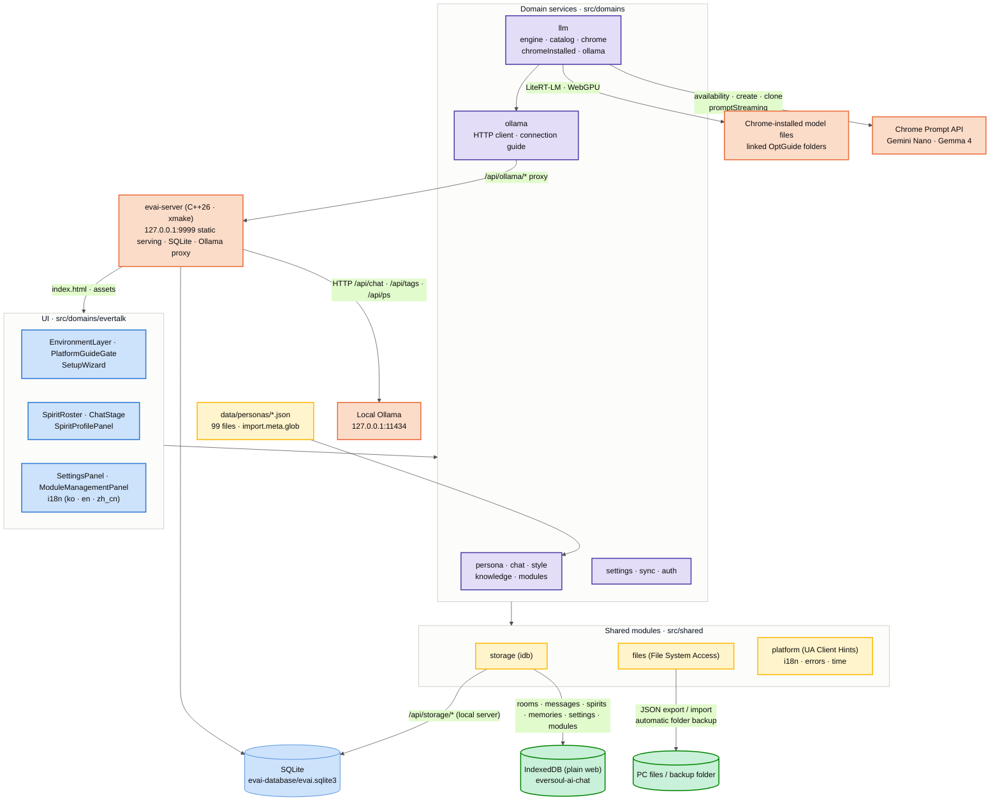

# EverSoul AI Chat architecture

<a href="../README.en.md">← README</a>

## Architecture

It is a React web app plus a C++26 local server. As a plain web page, data stays in IndexedDB and chats run on Chrome's built-in AI or the model files Chrome already downloaded. Opened through `evai-server`, the same web app uses the server SQLite database, and Ollama requests pass through the server `/api/ollama` proxy.

- **Environment detection**: PC desktop browsers are admitted. At startup `/api/runtime` decides whether this is the local server runtime, and that decides the engine list and the storage backend. `EnvironmentLayer` at the top shows the profile, browser and version, platform, and the WebGPU adapter confirmed through `requestAdapter()`.
- **Spirit data**: `src/domains/persona/archive.ts` loads `data/personas/*.json` through `import.meta.glob`, and the initial setup installs them into the IndexedDB `persona_profile` store. Per-language system prompts are cached in `persona_localized_prompt`.
- **System prompt**: The starting identity is assembled from the spirit's profile, personality and greeting, sampled lines from the complete speech/story/EverTalk corpus, and real `Savior → spirit` response exchanges. Each turn dynamically adds 3–8 recent exchanges derived from the complete DB timeline, deterministic outlines of older spans and prior rooms, related episodes, directives and keyword threads, emotion, bond and jealousy state, query-relevant excerpts from other spirits' conversations, world knowledge, and spirit-specific dataset records. `zh_cn` is normalized to Simplified Chinese with OpenCC and emoji are removed from output.
- **Chrome session**: Only the active spirit's session is kept. The system prompt is the first `system` entry of `initialPrompts`, followed by the spirit's real `Savior → spirit` exchanges as `user/assistant` examples. Each request `clone()`s the session and picks recent history with `contextWindow`, `contextUsage`, and `measureContextUsage()` while leaving 384 tokens for the reply.
- **Ollama session**: The same system prompt and examples go to `/api/chat`. Some templates, such as Mistral's, insist on strictly alternating user/assistant turns, so consecutive messages from the same role are merged with their content intact. Requests carry `truncate: false` and `shift: false` so Ollama never silently cuts the conversation, and a 1-token measurement request checks the real prompt length first. If it does not fit, the oldest context goes first; the system prompt, the examples, and this turn's instruction always stay. The context size follows what Ollama actually loaded (`context_length` from `/api/ps`).
- **Reply checks**: Every engine returns the same JSON schema, and a reply that breaks the voice or language rules is generated once more.
- **The spirit's heart**: Emotion is not left to the model; it is computed by folding the stored history (IndexedDB or SQLite). `src/domains/persona/temperament.ts` measures warmth, expressiveness and initiative from the spirit's original lines, turns them into a percentile among all 99 spirits, and blends them 50/50 with the cheat personality preset. `src/domains/chat/heart.ts` reads every room in time order to build affection, trust, longing, hurt and jealousy (0–100), then uses personality and bond level to decide how much shows outwardly, how readily the spirit accepts, and how often she reaches out. These values go into the `[YOUR HEART]` section every turn.
- **Messaging first**: Every minute each spirit with history is checked; longing, initiative, affection and jealousy raise the urge and hurt lowers it, which sets the wait, the chance and how many follow-ups are sent. Outgoing spirits keep messaging until you answer. It can be switched on or off in Settings.
- **Spirit actions**: The action line of a reply is saved as `spirit_action` on the same message record and is never fed back to the model. On screen it shows for a moment, then stays above the bubble as "(spirit name)'s action: …".
- **Relationship graph**: In the memory view, graph nodes appear one after another, and jealousy between spirits shows as nodes and "A→B x%" links. The panel beside it charts affection, trust, longing and hurt per day together with messages sent to other spirits, with a table view.
- **Language declaration**: `availability()` and `create()` use identical options. English (the system-instruction language) and the selected app language are declared in `expectedInputs`, while only the app language is declared in `expectedOutputs`; unsupported combinations fall back to the model's base multilingual capability.
- **Memory**: The reply and its episodic `Savior/Spirit` memory are committed in one storage transaction. On every turn, application logic reads the complete DB timeline and derives the recent flow, prior-session outlines, relationship changes, and relevant conversations with other spirits. Related episodes are found with a sparse lexical vector using 1–3 character n-grams hashed with FNV-1a into 512 dimensions and cosine similarity. The model never generates or stores digest, reflection, or consolidation records; it only generates the current reply.
- **Storage**: As a plain web page everything lives in the IndexedDB database `eversoul-ai-chat`, and persistent storage is requested at startup. On the local server everything lives in `evai-database/evai.sqlite3` in tables with real foreign keys (persona, chat_room, chat_message, persona_memory, persona_memory_source_message, and so on), and the `persona_conversation` view exposes each spirit history together with the other spirits. The server creates this file only when it is missing and otherwise opens the stored data as it is; there is no schema version.
- **Backup**: The File System Access API exports and imports all data (except `file_handle`) as a JSON file. When a PC folder is linked, `eversoul-ai-chat-backup-<timestamp>.json` and `eversoul-ai-chat-backup-latest.json` are written 5 seconds after a completed reply, a message or room deletion, a module change, or a change of language, reasoning display, skin, Preferred Soul, chat model, or notice acknowledgment (consecutive changes restart the 5-second wait), keeping only the 10 most recent timestamped backups. The folder handle is kept in the IndexedDB `file_handle` store, and you can restore any point from the list.
- **Localization**: UI text, notices, the blocked screen, and status/error messages are shown from the Korean, English, and Simplified Chinese labels in `src/domains/evertalk/i18n.ts`. Domain errors travel as codes (`DomainError`) and are turned into labels in the UI.

---

## Tech Stack

### Web app

- **Framework**: `React 19.3` + `TypeScript 7.0` + `Vite 8.3` (static build with `base: './'`)
- **State**: `TanStack React Query v5`, `Zustand v5`
- **Styling**: `Tailwind CSS v4` (`@tailwindcss/vite`) + `clsx`
- **Icons**: `lucide-react`
- **Lint**: `oxlint`

### Browser side

- **Chat engines**: Chrome Prompt API (`LanguageModel`), Chrome-installed model files (`@litert-lm/core`, WebGPU), local Ollama (through the EVAI local server proxy)
- **Storage**: IndexedDB (`idb` 8) as a plain web page, SQLite on the local server
- **Simplified Chinese**: Traditional-to-Simplified conversion with `opencc-js`
- **PC files and folders**: File System Access API (`showOpenFilePicker`, `showSaveFilePicker`, `showDirectoryPicker`)
- **Environment detection**: User-Agent Client Hints with a UA string fallback, `navigator.gpu.requestAdapter()`

### Local server launcher

- **Language and build**: C++26 through the xmake pipeline (`server/xmake.lua`, `server/build.sh`)
- **Database**: SQLite 3.53.4 amalgamation vendored at `server/vendor/sqlite3` and linked statically
- **Windows**: Visual Studio 2026 MSVC; the icon and version info are embedded as resources, leaving a single exe

---
