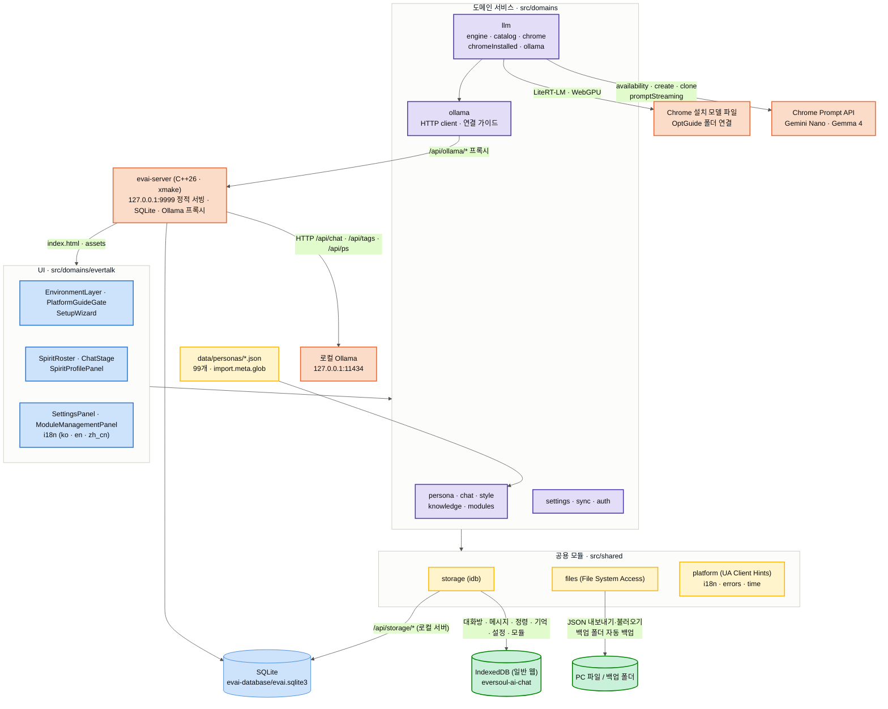

# EverSoul AI Chat 아키텍처

<a href="../README.md">← README</a>

## 아키텍처

구성은 React 웹 앱과 C++26 로컬 서버 둘입니다. 일반 웹으로 열면 데이터는 IndexedDB에 저장되고, 대화는 Chrome 내장 AI나 Chrome이 받아 둔 모델 파일로 진행됩니다. `evai-server`로 열면 같은 웹 앱이 서버의 SQLite 데이터베이스를 쓰고, Ollama 요청은 모두 서버의 `/api/ollama` 프록시를 지납니다.

- **이용 환경 판별**: PC 데스크톱 브라우저는 들어갈 수 있습니다. 시작할 때 `/api/runtime`으로 로컬 서버 여부를 먼저 정하고, 그 결과에 따라 사용할 엔진 목록과 저장소가 결정됩니다. 상단 `EnvironmentLayer`는 프로필, 브라우저와 버전, 플랫폼, `requestAdapter()`로 확인한 WebGPU 정보를 보여 줍니다.
- **정령 데이터**: `src/domains/persona/archive.ts`가 `import.meta.glob`으로 `data/personas/*.json`을 불러오고, 초기 설정 때 IndexedDB `persona_profile`에 설치합니다. 언어별 시스템 프롬프트는 `persona_localized_prompt`에 캐시합니다.
- **시스템 프롬프트**: 정령 원본의 프로필·성격·인사, 전체 말투/스토리/에버톡 말뭉치에서 분산 표집한 정령 발화 12개와 실제 `구원자 → 정령` 반응쌍 4개를 시작 정체성으로 조립합니다. 매 턴에는 현재 발화와 관련된 실제 반응쌍 최대 2개, 최근 대화 최대 18개, 관련 기억 최대 4개(후보 200개 중), 지식 데이터 최대 1개가 동적으로 추가됩니다. 누적된 digest·명시 기억·semantic 관계 상태·습관·인연 수치는 실제 기록이 생긴 뒤에만 시작값을 변화시킵니다. `zh_cn`은 OpenCC로 간체화하고 출력 이모지를 제거합니다.
- **Chrome 세션**: 지금 대화하는 정령 하나의 세션만 유지합니다. 시스템 프롬프트를 `initialPrompts`의 첫 `system`으로 넣고, 정령 JSON의 실제 `구원자 → 정령` 반응쌍을 이어지는 `user/assistant` 예시 대화로 넣습니다. 요청마다 세션을 `clone()`하고 `contextWindow`·`contextUsage`·`measureContextUsage()`로 응답용 384토큰을 남긴 채 최근 대화를 고릅니다.
- **Ollama 세션**: 같은 시스템 프롬프트와 예시 대화를 `/api/chat`으로 보냅니다. Mistral 계열처럼 user/assistant 교대를 강제하는 템플릿이 있어서, 연속된 같은 역할 메시지는 내용을 그대로 합쳐 보냅니다. Ollama가 넘친 대화를 조용히 잘라내지 않도록 `truncate: false`, `shift: false`를 주고, 생성 전에 1토큰짜리 측정 요청으로 실제 프롬프트 길이를 잽니다. 넘치면 오래된 맥락부터 빼고, 시스템 프롬프트와 예시 대화, 이번 턴 지시는 끝까지 남깁니다. 컨텍스트 크기는 Ollama가 실제로 올린 값(`/api/ps`의 `context_length`)을 따릅니다.
- **응답 검사**: 모든 엔진의 결과를 같은 JSON 스키마로 받고, 말투와 언어를 어기면 한 번 다시 생성합니다.
- **정령의 마음**: 감정은 모델에게 맡기지 않고 저장된 대화 기록(IndexedDB 또는 SQLite)을 로직으로 접어서 계산합니다. `src/domains/persona/temperament.ts`가 정령 원본 대사에서 다정함·표현력·주도성을 재어 99명 안의 백분위로 바꾸고 치트 성격과 50%씩 섞습니다. `src/domains/chat/heart.ts`는 모든 대화방의 기록을 시간순으로 읽어 애정·신뢰·그리움·상처·질투(0~100)를 만들고, 성격과 인연도 레벨에 따라 겉으로 드러나는 정도·받아주는 정도·먼저 다가가는 정도를 정합니다. 이 값은 매 턴 `[YOUR HEART]` 섹션으로 들어갑니다.
- **먼저 말 걸기**: 1분마다 대화 기록이 있는 모든 정령을 살펴, 그리움·주도성·애정·질투는 높이고 상처는 낮추는 마음 값으로 기다리는 시간·확률·재촉 횟수를 정합니다. 성격이 적극적인 정령은 답이 올 때까지 여러 번 보냅니다. 설정에서 켜고 끌 수 있습니다.
- **정령의 행동**: 응답의 행동 문장은 같은 메시지 레코드의 `spirit_action`에 저장되고 모델 기록에는 넣지 않습니다. 화면에서는 잠시 표시된 뒤 말풍선 위에 "(정령 이름)의 행동: …"으로 남습니다.
- **관계도**: 기억 화면 그래프는 노드가 차례로 나타나고, 정령끼리의 질투를 노드와 "A→B x%" 연결선으로 보여 줍니다. 옆 패널에는 날짜별 애정·신뢰·그리움·상처 변화와 다른 정령에게 보낸 메시지 수가 차트와 표로 나옵니다.
- **언어 선언**: `availability()`와 `create()`에 같은 옵션을 사용합니다. 시스템 지시문 언어인 영어와 앱 언어를 `expectedInputs`에, 앱 언어만 `expectedOutputs`에 선언하며, 해당 조합을 지원하지 않으면 모델의 기본 다국어 능력으로 전환합니다.
- **기억**: 응답 메시지와 매 턴의 `구원자/정령` 에피소드 기억은 하나의 IndexedDB 트랜잭션으로 저장됩니다. 1~3글자 n-gram을 FNV-1a로 512차원에 희소 저장한 어휘 벡터와 코사인 유사도로 관련 기억을 찾고, 마지막 성공 이후 기억이 8개 쌓이면 최근 30개를 대화 모델로 통합합니다. 최근 원문 범위를 벗어날 대화가 6개 이상 쌓이면 먼저 압축해 같은 턴의 시스템 프롬프트에 고정합니다.
- **저장소**: 일반 웹에서는 IndexedDB `eversoul-ai-chat` 하나에 모든 데이터를 두고 시작할 때 영구 저장을 요청합니다. 로컬 서버에서는 `evai-database/evai.sqlite3` 한 파일에 외래키를 갖춘 테이블(persona, chat_room, chat_message, persona_memory, persona_memory_source_message 등)로 저장하고, 정령별·정령 간 대화 내역은 `persona_conversation` 뷰로 함께 조회합니다. 서버는 이 파일이 없을 때만 새로 만들고, 있으면 저장된 데이터를 그대로 엽니다. 스키마 버전 개념은 없습니다.
- **백업**: File System Access API로 전체 데이터(`file_handle` 제외)를 JSON 파일로 내보내고 불러옵니다. PC 폴더를 연결하면 응답 완료, 메시지·대화방 삭제, 모듈 변경, 언어·추론 표시·스킨·선호정령·대화 모델·안내 확인 변경 후 5초 뒤(연속 변경은 마지막 기준) `eversoul-ai-chat-backup-<시각>.json`과 `eversoul-ai-chat-backup-latest.json`을 쓰고, 시각별 백업은 최근 10개만 남깁니다. 폴더 핸들은 IndexedDB `file_handle`에 보관되며, 목록에서 원하는 시점으로 복원할 수 있습니다.
- **다국어**: UI 문구, 안내, 차단 화면, 상태·오류 메시지는 `src/domains/evertalk/i18n.ts`의 한국어·영어·중국어(간체) 라벨로 표시됩니다. 도메인 오류는 코드(`DomainError`)로 전달되고 화면에서 라벨로 바뀝니다.

---

## 기술 스택

### 웹 앱

- **프레임워크**: `React 19.3` + `TypeScript 7.0` + `Vite 8.3` (`base: './'` 정적 빌드)
- **상태 관리**: `TanStack React Query v5`, `Zustand v5`
- **스타일**: `Tailwind CSS v4`(`@tailwindcss/vite`) + `clsx`
- **아이콘**: `lucide-react`
- **검사**: `oxlint`

### 브라우저 쪽

- **대화 엔진**: Chrome Prompt API(`LanguageModel`), Chrome 설치 모델 파일(`@litert-lm/core`, WebGPU), 로컬 Ollama(EVAI 로컬 서버 프록시 경유)
- **저장소**: 일반 웹은 IndexedDB(`idb` 8), 로컬 서버는 SQLite
- **중국어 간체 고정**: `opencc-js`의 번체→간체 변환
- **PC 파일과 폴더**: File System Access API(`showOpenFilePicker`, `showSaveFilePicker`, `showDirectoryPicker`)
- **실행 환경 판별**: User-Agent Client Hints와 UA 문자열, `navigator.gpu.requestAdapter()`

### 로컬 서버 실행기

- **언어와 빌드**: C++26, xmake 파이프라인 (`server/xmake.lua`, `server/build.sh`)
- **데이터베이스**: SQLite 3.53.4 amalgamation을 `server/vendor/sqlite3`에 두고 정적 링크
- **윈도우**: Visual Studio 2026 MSVC, 아이콘과 버전 정보를 리소스로 넣어 exe 하나로 동작

---
